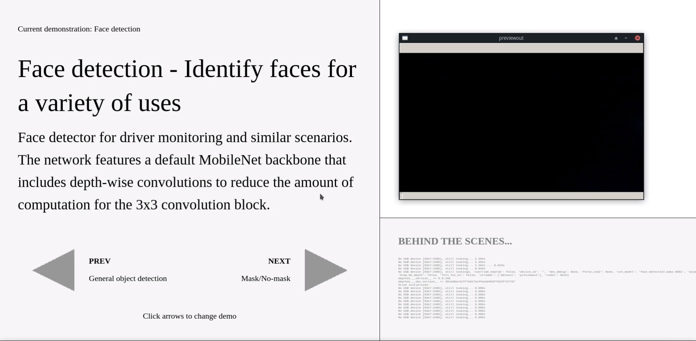

[depthai_experiments中文文档](README.zh-CN.md)

# depthai-experiments
Experimental projects we've done with DepthAI.  

**Experiments** can be anything from "here's some code and it works sometimes" to "this is almost a tutorial".  

The following list isn't exhaustive (as we randomly add experiments and we may forget to update this list):

## [Gen2] Gaze estimation ([here](https://github.com/luxonis/depthai-experiments/tree/master/gen2-gaze-estimation))

This example demonstrates how to run 3 stage (3-series, 2 parallel) inference on DepthAI using [Gen2 Pipeline Builder](https://github.com/luxonis/depthai/issues/136).

Origina OpenVINO demo, on which this example was made, is [here](https://github.com/LCTyrell/Gaze_pointer_controller)

## [Gen2] Subpixel and LR-Check Disparity Depth ([here](https://github.com/luxonis/depthai-experiments/tree/master/gen2-camera-demo))

This example shows how to do Subpixel, LR-Check or Extended Disparity, and also how to project these measurements into a point cloud for visualization.  This uses the [Gen2 Pipeline Builder](https://github.com/luxonis/depthai/issues/136).

## [Gen2] Age Gender ([here](https://github.com/luxonis/depthai-experiments/tree/master/gen2-age-gender#gen2-age--gender-recognition))

This shows a simple two-stage neural inference example, doing face detection and then age/gender estimation based on the face.

## [Gen2] Text Detection + Optical Character Recognition (OCR) Pipeline ([here](https://github.com/luxonis/depthai-experiments/tree/master/gen2-ocr#gen2-text-detection--optical-character-recognition-ocr-pipeline))

This pipeline implements text detection (EAST) followed by optical character recognition of the detected text. 

## [Gen2] Pedestrian Reidentification ([here](https://github.com/luxonis/depthai-experiments/tree/master/gen2-pedestrian-reidentification))

This example demonstrates how to run 2 stage inference on DepthAI using Gen2 Pipeline Builder to identify and re-identify pedestrians with unique IDs.

Original OpenVINO demo, on which this example was made, is [here](https://docs.openvinotoolkit.org/2020.1/_demos_pedestrian_tracker_demo_README.html).

## COVID-19 Mask / No-Mask Detector ([here](https://github.com/luxonis/depthai-experiments/blob/master/coronamask))

This project shows you how to run the COVID-19 mask/no-mask object detector which was trained [here](https://github.com/luxonis/depthai-ml-training/tree/master/colab-notebooks#covid-19-maskno-mask-training-)

## Social Distancing Example ([here](https://github.com/luxonis/depthai-experiments/tree/master/social-distancing))
Since DepthAI gives the full 3D position of objects in physical space, it's a couple lines of code to make a social-distancing monitor with DepthAI.  So that's what this project is, a quick cut at a social-distancing monitor.

## Demo-UI ([here](https://github.com/luxonis/depthai-python/tree/gen2_develop/examples))
Application used to demonstrate various capabilities of the DepthAI platform. Contains examples with descriptions,
console outputs and preview windows.

## MJPEG and JSON streaming ([here](https://github.com/luxonis/depthai-experiments/tree/master/gen2-mjpeg-streaming))

This lay the groundwork to make DepthAI [OpenDataCam](https://github.com/opendatacam/opendatacam) compatible.

## Stereo Neural Inference Results Visualizer ([here](https://github.com/luxonis/depthai-experiments/tree/master/gen2-triangulation))

Because there are often application-specific host-side filtering to be done on the stereo neural inference results, and because these calculations are lightweight (i.e. could be done on an ESP32), we leave the triangulation itself to the host.

## People Counting ([here](https://github.com/luxonis/depthai-experiments/blob/master/people-counter))

This is a basic usage example of megaAI and/or DepthAI (although it doesn't actually use the depth aspect of DepthAI): simply counting people in a scene and logging this count.

So you could use this to make plots over a day of room occupancy.  One could modify this example to show *where* in a room those people were, over time, if desirable.  But for now it just produces a count of people - so the total in view of the camera - over time.

## People Tracker ([here](https://github.com/luxonis/depthai-experiments/tree/master/gen2-people-tracker))

This application counts how many people went upwards / downwards / leftwards / rightwards in the video stream, allowing you to receive an information about how many people went into a room or went through a corridor.

The model used in this example is [person_detection_retail_0013](https://docs.openvinotoolkit.org/latest/omz_models_intel_person_detection_retail_0013_description_person_detection_retail_0013.html) from the OpenVIN Model Zoo.

## Recording and reconstruction of the scene ([here](https://github.com/luxonis/depthai-experiments/tree/master/gen2-record-replay))

The `record.py` app syncs all streams (across all devices) and saves them into mjpeg/h265 files, or, in case of depth, into rosbag that can be viewed by the [RealSense Viewer](https://www.intelrealsense.com/sdk-2/#sdk2-tools) (gif below). `Replay` class is used to send the frames back to the device, and it allows reconstruction of the depth perception from two (synced) mono frames.

## Point Cloud Projection ([here](https://github.com/luxonis/depthai-experiments/blob/master/point-cloud-projection))

This is a simple application which creates rgbd image from `right` and `depth_raw` stream and projects it into point clouds. There is also a interactive point cloud visualizer. (depth_raw with left and rgb will be added soon)

## RGB-D and PCL ([here](https://github.com/luxonis/depthai-experiments/tree/master/pcl-projection-rgb))

This is a simple application which creates rgbd image from `rgb` and `depth` stream and projects it into rgb with depth overlay and point clouds. There is also a interactive point cloud visualizer.

## Host-Side WLS Filter ([here](https://github.com/luxonis/depthai-experiments/tree/master/gen2-wls-filter))

This gives an example of doing host-side WLS filtering using the `rectified_right` and `depth` stream from DepthAI.

Example running on [BW1092](https://shop.luxonis.com/collections/all/products/bw1092-pre-order) shown below:

## Human-Machine safety ([here](https://github.com/luxonis/depthai-experiments/tree/master/gen2-human-machine-safety))

Calculates palm spatial coordinates on the host and calculates spatial distance between the palm and a dangerous object.
If spatial distance is below selected threshold, it will warn the user.

## Multiple devices per host ([here](https://github.com/luxonis/depthai-experiments/tree/master/gen2-multiple-devices))

This demo shows how you can use multiple devices per host. The demo will find all devices connected to the host and display an RGB preview from each of them.

