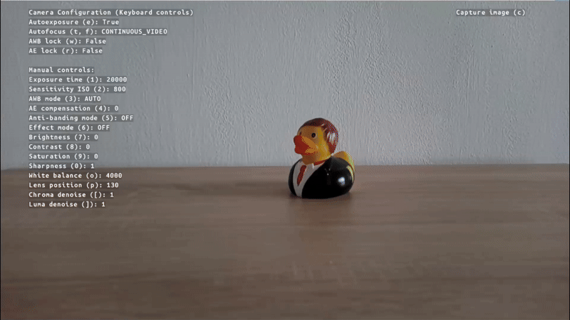
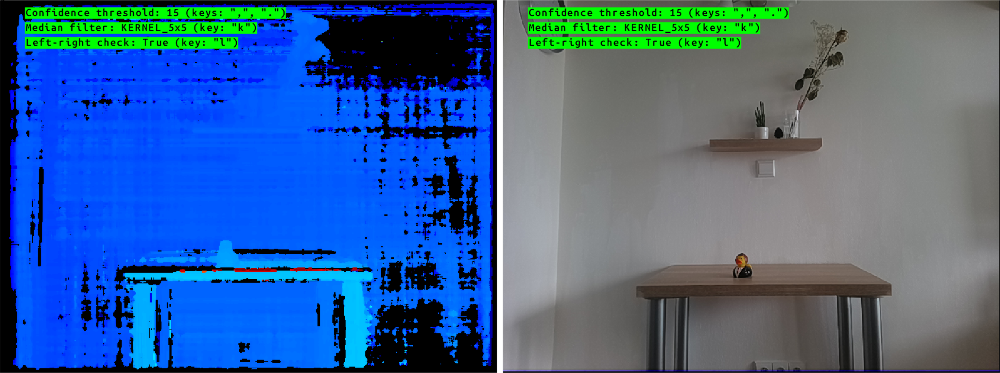
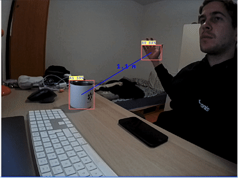

# DepthAI Experiments

The repository contains various demonstrations, tutorials, and examples showcasing different capabilities of DepthAI and OAK devices. Each category focuses on specific aspects of the technology.

Click on any category below to explore detailed examples for that specific domain.

## Categories

### [📱 Apps](apps/)

<table style="width: 100%; table-layout: fixed;">
  <tr>
    <td width="50%" valign="top">
      
    </td>
    <td width="50%" style="padding-left: 20px;" valign="middle" align="center">
      Ready-to-use applications built with DepthAI, demonstrating real-world use cases and implementations. Here are also demos that we present at different conferences showing advanced use cases.
        
      <a href="apps/">📱 Explore Apps</a>
    </td>
  </tr>
</table>

### [🎥 Camera Controls](camera-controls/)

<table style="width: 100%; table-layout: fixed;">
  <tr>
    <td width="50%" valign="top">
      
    </td>
    <td width="50%" style="padding-left: 20px;" valign="middle" align="center">
      Examples demonstrating various camera control features like focus, exposure, white balance, and other camera parameters.
        
      <a href="camera-controls/">🎥 Explore Camera Controls</a>
    </td>
  </tr>
</table>

### [🔌 Integrations](integrations/)

<table style="width: 100%; table-layout: fixed;">
  <tr>
    <td width="50%" valign="top">
      
    </td>
    <td width="50%" style="padding-left: 20px;" valign="middle" align="center">
      Shows how to integrate DepthAI with <a href="https://hub.luxonis.com/">Luxonis Hub</a>, <a href="https://docs.foxglove.dev/docs/introduction/">Foxglove</a>, <a href="https://rerun.io/docs/getting-started/what-is-rerun">Rerun</a> and <a href="https://roboflow.com">Roboflow</a>.
        
      <a href="integrations/">🔌 Explore Integrations</a>
    </td>
  </tr>
</table>

### [🖥️ Custom Frontend](custom-frontend/)

<table style="width: 100%; table-layout: fixed;">
  <tr>
    <td width="50%" valign="top">
      
    </td>
    <td width="50%" style="padding-left: 20px;" valign="middle" align="center">
      Examples showing how to implement a custom Front-End application using React and <a href="https://www.npmjs.com/package/@luxonis/depthai-viewer-common?activeTab=readme">@luxonis/depthai-viewer-common</a> package to connect to DepthAI application.
        
      <a href="custom-frontend/">🖥️ Explore Custom Frontend</a>
    </td>
  </tr>
</table>

### [📏 Depth Measurement](depth-measurement/)

<table style="width: 100%; table-layout: fixed;">
  <tr>
    <td width="50%" valign="top">
      
    </td>
    <td width="50%" style="padding-left: 20px;" valign="middle" align="center">
      Demonstrations of depth perception capabilities, including spatial calculations, depth visualization, and 3D measurements including pointcloud.
        
      <a href="depth-measurement/">📏 Explore Depth Measurement</a>
    </td>
  </tr>
</table>

### [🧠 Neural Networks](neural-networks/)

<table style="width: 100%; table-layout: fixed;">
  <tr>
    <td width="50%" valign="top">
      
    </td>
    <td width="50%" style="padding-left: 20px;" valign="middle" align="center">
      Comprehensive collection of AI model usage, including object detection, classification, segmentation, and many more.
        
      <a href="neural-networks/">🧠 Explore Neural Networks</a>
    </td>
  </tr>
</table>

### [🔄 Stream Manipulation](streaming/)

<table style="width: 100%; table-layout: fixed;">
  <tr>
    <td width="50%" valign="top">
      
    </td>
    <td width="50%" style="padding-left: 20px;" valign="middle" align="center">
      Examples showing different ways to stream data from DepthAI devices. This includes MJPEG, H.264, H.265, MQTT, TCP, RTSP, and WebRTC.
        
      <a href="streaming/">🔄 Explore Stream Manipulation</a>
    </td>
  </tr>
</table>

### [📚 Tutorials](tutorials/)

<table style="width: 100%; table-layout: fixed;">
  <tr>
    <td width="50%" valign="top">
      
    </td>
    <td width="50%" style="padding-left: 20px;" valign="middle" align="center">
      Explore a variety of step-by-step guides and educational content designed to help you master DepthAI. Whether you're a beginner looking to get started or an experienced user aiming to explore advanced topics, these tutorials cover a range of concepts, from basic camera usage and displaying detections to working with custom models and multiple devices.
        
      <a href="tutorials/">📚 Explore Tutorials</a>
    </td>
  </tr>
</table>
