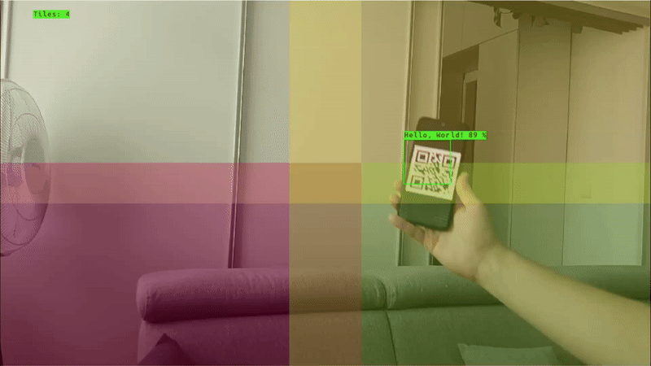

# DepthAI Experiments

The repository contains various demonstrations, tutorials, and examples showcasing different capabilities of DepthAI and OAK devices. Each category focuses on specific aspects of the technology.

Click on any category below to explore detailed examples for that specific domain.

## Categories

### [📱 Apps](apps/)

|  |  |
|---|---|
|  | Ready-to-use applications built with DepthAI, demonstrating real-world use cases and implementations. Here are also demos that we present at different conferences showing advanced use cases. |

### [🎥 Camera Controls](camera-controls/)

|  |  |
|---|---|
|  | Examples demonstrating various camera control features like focus, exposure, white balance, and other camera parameters. |

### [🔌 Integrations](integrations/)

|  |  |
|---|---|
|  | Shows how to integrate DepthAI with [Luxonis Hub](https://hub.luxonis.com/), [Foxglove](https://docs.foxglove.dev/docs/introduction/), [Rerun](https://rerun.io/docs/getting-started/what-is-rerun) and [Roboflow](https://roboflow.com). |

### [🖥️ Custom Frontend](custom-frontend/)

|  |  |
|---|---|
|  | Examples showing how to implement a custom Front-End application using React and [@luxonis/depthai-viewer-common](https://www.npmjs.com/package/@luxonis/depthai-viewer-common?activeTab=readme) package to connect to DepthAI application. |

### [📏 Depth Measurement](depth-measurement/)

|  |  |
|---|---|
|  | Demonstrations of depth perception capabilities, including spatial calculations, depth visualization, and 3D measurements including pointcloud. |

### [🧠 Neural Networks](neural-networks/)

|  |  |
|---|---|
|  | Comprehensive collection of AI model usage, including object detection, classification, segmentation, and many more. |

### [🔄 Stream Manipulation](streaming/)

|  |  |
|---|---|
|  | Examples showing different ways to stream data from DepthAI devices. This includes MJPEG, H.264, H.265, MQTT, TCP, RTSP, and WebRTC. |

### [📚 Tutorials](tutorials/)

|  |  |
|---|---|
|  | Explore a variety of step-by-step guides and educational content designed to help you master DepthAI. Whether you're a beginner looking to get started or an experienced user aiming to explore advanced topics, these tutorials cover a range of concepts, from basic camera usage and displaying detections to working with custom models and multiple devices. |
