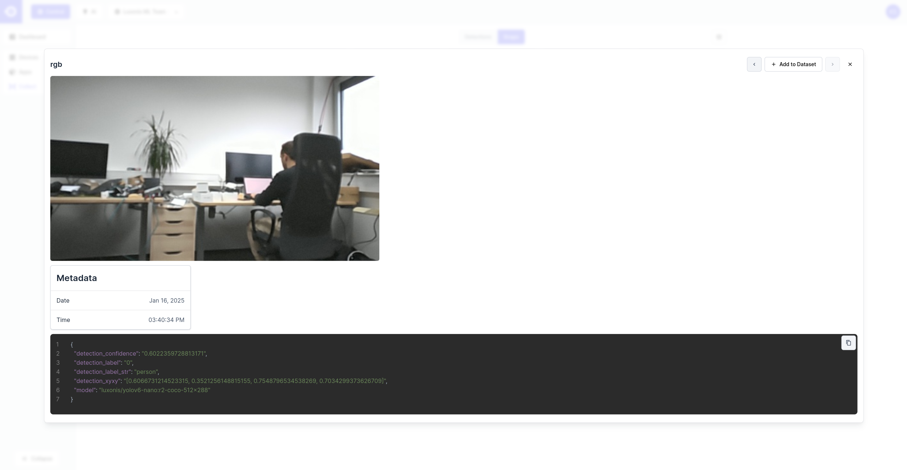

# DepthAI Experiments

The repository contains various demonstrations, tutorials, and examples showcasing different capabilities of DepthAI and OAK devices. Each category focuses on specific aspects of the technology.

Click on any category below to explore detailed examples for that specific domain.

## Categories

### [📱 Apps](apps/)

Ready-to-use applications built with DepthAI, demonstrating real-world use cases and implementations. Here are also demos that we present at different conferences showing advanced use cases.

### [🎥 Camera Controls](camera-controls/)

Examples demonstrating various camera control features like focus, exposure, white balance, and other camera parameters.

### [🔌 Connectivity](connectivity/)

Shows how to integrate DepthAI with different frameworks and tools like [Hub](https://hub.luxonis.com/), [Foxglove](https://docs.foxglove.dev/docs/introduction/) or [Rerun](https://rerun.io/docs/getting-started/what-is-rerun).

### [🖥️ Custom Frontend](custom-frontend/)

Examples showing how to implement a custom Front-End application using React and [@luxonis/depthai-viewer-common](https://www.npmjs.com/package/@luxonis/depthai-viewer-common?activeTab=readme) package to connect to DepthAI application.

### [📏 Depth Measurement](depth-measurement/)

Demonstrations of depth perception capabilities, including spatial calculations, depth visualization, and 3D measurements including pointcloud.

### [🧠 Neural Networks](neural-networks/)

Comprehensive collection of AI model usage, including object detection, classification, segmentation, and many more.

### [🔄 Stream Manipulation](stream-manipulation/)

Examples showing different ways to stream data from DepthAI devices, including MQTT, TCP, RTSP, and WebRTC implementations.

### [📚 Tutorials](tutorials/)

Step-by-step guides and educational content to help you get started with DepthAI.

