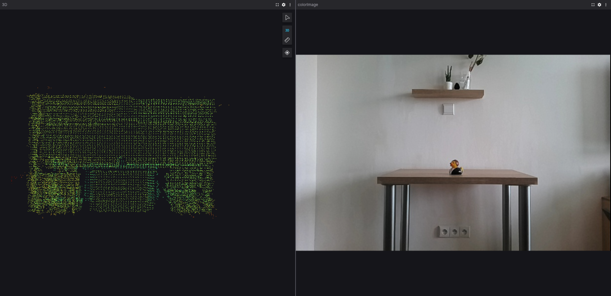

# Foxglove Connection

This example demonstrates how to use a **Luxonis device** for streaming to [Foxglove Studio](https://foxglove.dev/). Example uses `Foxglove`'s `websocket` to stream frames or point clouds.

## Demo



## Installation

Running this example requires a **Luxonis device** connected to your computer. You can find more information about the supported devices and the set up instructions in our [Documentation](https://rvc4.docs.luxonis.com/hardware).

Install required packages by running:

```bash
pip install -r requirements.txt
```

## Usage

You can run the experiment fully on device (`STANDALONE` mode) or using your your computer as host (`PERIPHERAL` mode).

Here is a list of all available parameters:

```
-d DEVICE, --device DEVICE
                      Optional name, DeviceID or IP of the camera to connect
                      to. (default: None)
-fps FPS_LIMIT, --fps-limit FPS_LIMIT
                      FPS limit. (default: None)
-l, --left            Enable left camera stream. (default: False)
-r, --right           Enable right camera stream. (default: False)
-pc, --pointcloud     Enable pointcloud stream. (default: False)
-nc, --no-color       Disable color camera stream. (default: False)

```

To see the streams, open [Foxglove Studio](https://app.foxglove.dev/), choose `Open connection` and `Foxglove WebSocket`.

### Peripheral Mode

Running in peripheral mode requires a host computer. Below are some examples of how to run the example.

#### Examples

```bash
python3 main.py
```

This will run the experiment with the color camera stream only.

```bash
python3 main.py --pointcloud
```

This will run the experiment with the color camera stream and point cloud stream.

### Standalone Mode

Running the example in the [Standalone mode](https://rvc4.docs.luxonis.com/software/depthai/standalone/), app runs entirely on the device.
To run the example in this mode, first install the [oakctl](https://rvc4.docs.luxonis.com/software/tools/oakctl/) command-line tool (enables host-device interaction) as:

```bash
bash -c "$(curl -fsSL https://oakctl-releases.luxonis.com/oakctl-installer.sh)"
```

The app can then be run with:

```bash
oakctl connect <DEVICE_IP>
oakctl app run .
```

This will run the experiment with default argument values. If you want to change these values you need to edit the `oakapp.toml` file.
