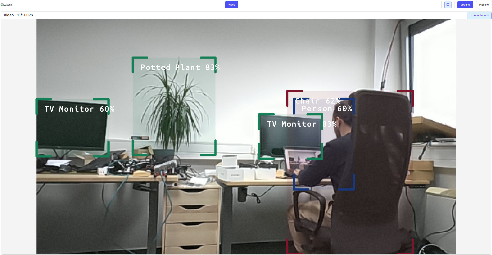
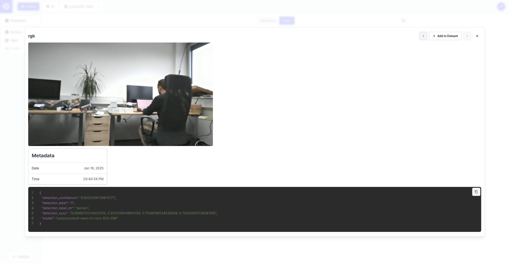

# Hub Snaps & Events

This experiment demonstrates how to create a simple application that sends snaps to [Hub](https://hub.luxonis.com/). This is ideal for constant dataset collection based on some predefined conditions and thus preparing for further tunning of your model. The example is using [YOLOv6](https://hub.luxonis.com/ai/models/face58c4-45ab-42a0-bafc-19f9fee8a034) object detector. The frames where `person` is detected with confidence below 0.7 get sent to Hub as a new snap together with detection metadata. Currently new snap can be generated 1 minute or more after the previous one but this can be configured to better fit your needs. You can see new snaps under [Control/Collect/Snaps](https://hub.luxonis.com/control/collect?view=grid). The experiment works on both RVC2 and RVC4.

## Demo

|             Visualizer view              |         Snap on Hub         |
| :--------------------------------------: | :-------------------------: |
|  |  |

## Installation

Running this example requires a **Luxonis device** connected to your computer. You can find more information about the supported devices and the set up instructions in our [Documentation](https://rvc4.docs.luxonis.com/hardware).

Install required packages by running:

```bash
pip install -r requirements.txt
```

## Usage

You can run the experiment fully on device (`STANDALONE` mode) or using your your computer as host (`PERIPHERAL` mode). `STANDALONE` mode is only supported on RVC4.

Here is a list of all available parameters:

```
-d DEVICE, --device DEVICE
                    Optional name, DeviceID or IP of the camera to connect to. (default: None)
-key API_KEY, --api-key API_KEY
                    HubAI API key of your team. Not required if 'DEPTHAI_HUB_API_KEY' environment variable is set. (default: )
-fps FPS_LIMIT, --fps_limit FPS_LIMIT
                    FPS limit for the model runtime. (default: None)
-media MEDIA_PATH, --media_path MEDIA_PATH
                    Path to the media file you aim to run the model on. If not set, the model will run on the camera input. (default: None)
```

Here is a list of all available parameters:

Running in peripheral mode requires a host computer and there will be communication between device and host which could affect the overall speed of the app. Below are some examples of how to run the example.

#### Examples

```bash
python3 main.py --api-key <API_KEY>
```

This will run the Hub Snaps & Events experiment with the default device and camera input.

### Standalone Mode

Running the example in the [Standalone mode](https://rvc4.docs.luxonis.com/software/depthai/standalone/), app runs entirely on the device.
To run the example in this mode, first install the [oakctl](https://rvc4.docs.luxonis.com/software/tools/oakctl/) command-line tool (enables host-device interaction) as:

```bash
bash -c "$(curl -fsSL https://oakctl-releases.luxonis.com/oakctl-installer.sh)"
```

Replace `<API_KEY>` with your Hub API key in the [oakapp.toml](oakapp.toml) file.

The app can then be run with:

```bash
oakctl connect <DEVICE_IP>
oakctl app run .
```

This will run the experiment with default argument values. If you want to change these values you need to edit the `oakapp.toml` file.
