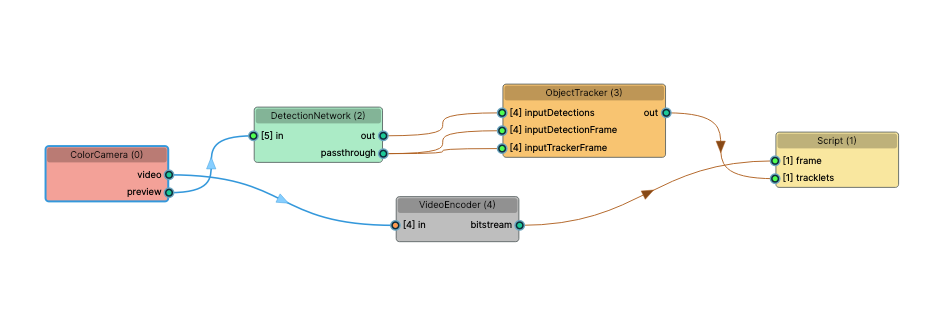

# Cumulative Object Counting - standalone mode

 

This example is an extension of Cumulative object counting that can be used in standalone mode. It works by first uploading the pipeline to the Oak camera along with instructions to create a websocket server and send datastream upon connection. The host side (eg. PC) works by decoding the bitstream and showing both the camera stream as well as NN output.

## Installation

```
python3 -m pip install -r requirements.txt
```
## Instructions for execution


Run the uploader script - it will flash the pipeline to the Oak device.
```
python3 oak.py 
```

Replace `OAK_IP` in host.py script with Oak camera ip (find camera ip using [device manager](https://docs.luxonis.com/projects/api/en/latest/components/bootloader/#device-manager)). 

Run the host file:
```
python3 host.py
```

## Pipeline graph



## Inspired by / Based on
* [Tensorflow 2 Object Counting](https://github.com/TannerGilbert/Tensorflow-2-Object-Counting)
* [OpenCV People Counter](https://www.pyimagesearch.com/2018/08/13/opencv-people-counter/) 
* [tensorflow_object_counting_api](https://github.com/ahmetozlu/tensorflow_object_counting_api)