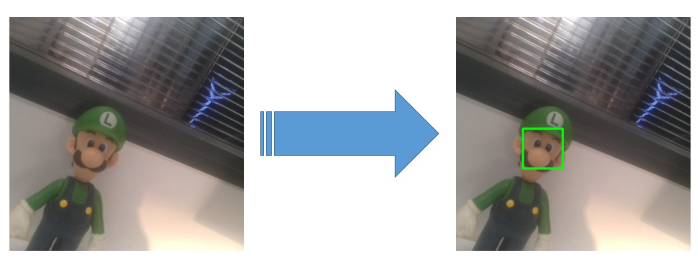

[中文文档](README.zh-CN.md)

Face recognition
================

This example demonstrates the Gen2 Pipeline Builder running [face detection network](https://docs.openvinotoolkit.org/2021.3/omz_models_model_face_detection_retail_0004.html), [head posture estimation network](https://docs.openvinotoolkit.org/2021.3/omz_models_model_head_pose_estimation_adas_0001.html) and [face recognition network](https://docs.openvinotoolkit.org/2021.3/omz_models_model_face_recognition_mobilefacenet_arcface.html)

## Demo

[](https://www.youtube.com/watch?v=HNAeBwNCRek "Face recognition")

## Usage

```bash
usage: main.py [-name NAME]

optional arguments:
  -name, --name     Name of the person for database saving [Optional]

```

**Before this example works, you have to "teach" it what face to associate with which name:**

1. Run `python3 main.py --name JohnDoe`. Then you should face the camera to JohnDoe from different angles, so he will later be recognized from different angles as well. This will just save (his) face vectors to the person's databse (in this case `JohnDoe.npz`).
2. Repeat step 1 for other people you would like to recognize
3. Run `python3 main.py` for face recognition demo. Whenever the device sees a new face, it will calculate the face vector (arcface NN model) and it will get compared with other vectors from the databases (`.npz`) using cosine distance.


## How it works:

### 1. Run the face detection model

> Run the [face-detection-retail-0004](models/face-detection-retail-0004_openvino_2020_1_4shave.blob) model to 
> detect the face in the image and intercept the facial image.
> 
> 

### 2. Run head-pose-estimation model

> Run the [head-pose-estimation-adas-0001](models/head-pose-estimation-adas-0001.blob) model to 
> Detect head tilt angle and adjust head posture.
> 
>

### 3. Run face recognition model

> Run the [face-recognition-mobilefacenet-arcface.blob](models/face-recognition-mobilefacenet-arcface_2021.2_4shave.blob) model to 
> Recognize the face.
>
> 

--------------------

## Pre-requisites

Install requirements

```bash
python3 -m pip install -r requirements.txt
```
