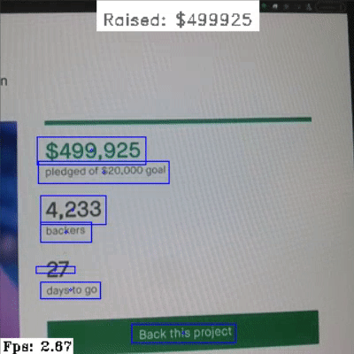

## [Gen2] Text Detection with Differential Binarization + Optical Character Recognition (OCR) Pipeline

This pipeline implements text detection with differential binarization followed by optical character recognition of the detected text. Model is taken from [OpenCV Zoo](https://github.com/opencv/opencv_zoo) and converted to blob that can run on OAK-D devices.

Input shape to NN is 320x320, confidence map is returned in the 1st stage. Bounding boxes are then extracted and forward to second stage, that expects an output of 32x100 (HxW).



### Important notes

* Rotated text is currently not supported and performance will be bad. This example will be updated once ImageManip Node is updated to correctly crop the area. Right now you can manually change the center of the crop area so it works for your example by changing these 2 lines:

  ```python
  # create rr for image manip
  rr = dai.RotatedRect()
  rr.center.x = cx + 15 # manually add so the crop is centered (myb bug in Manip)
  rr.center.y = cy
  rr.size.width = width * 1.2
  rr.size.height = height# * 1.05
  rr.angle = 0
  ```

* Support for 3D text recognition is not yet implemented, and will be once the ImageManip is updated.

* Default threshold for bitmap is set higher for this example. If you lower it, consider lowering `UNCLIP_RATIO` in code, otherwise crops sent to recognition stage will be bigger than the detected area.

* This example also includes regex filtering and parsing of the amount that can be seen in the above GIF. If you wish to change or remove this, search for the following code in the `main_db.py`:

    ```python
    r = re.compile('s[0-9]{6}')
    raised_list = list(filter(r.match, texts))  # Read Note below
    print(raised_list)
    if len(raised_list) > 0:
        raised_amount = int(raised_list[0][1:])
        raised_text = f"Raised: ${raised_amount}"
        (w, h), _ = cv2.getTextSize(raised_text, cv2.FONT_HERSHEY_DUPLEX, 0.5, 1)
        cv2.rectangle(frame, (160 - w//2 - 5, 0), (160 + w//2 + 5, h + 15), color_white, -1)
        cv2.putText(frame, raised_text, (160 - w//2, 0 + h + 10), cv2.FONT_HERSHEY_DUPLEX,
                    0.5, (100, 100, 100) if raised_amount < 500000 else (255, 0, 255))
	```

* Right now words are not separated when passed to the 2nd stage, so long text will likely be not correctly recognized.

## Pre-requisites

1. Purchase a DepthAI (or OAK) model (see [shop.luxonis.com](https://shop.luxonis.com/)).

3. Install requirements.
   ```
   python3 -m pip install -r requirements.txt
   ```
   *Note: if you are using windows and have problems with installing shapely library, please consider using Conda environment.*

## Usage

```
python3 main_db.py [options]
```

Options:

* `-bt, --box_thresh`: Set the box confidence threshold. Default: *0.3*.
* `-t, --thresh`: Set the bitmap threshold. Default: *0.6*.
* `-ms, --min_size`: Set the minimum size of box (area). Default: *2*.
* `-mc, --max_candidates`: Maximum number of returned box candidates. Default: *50*.

