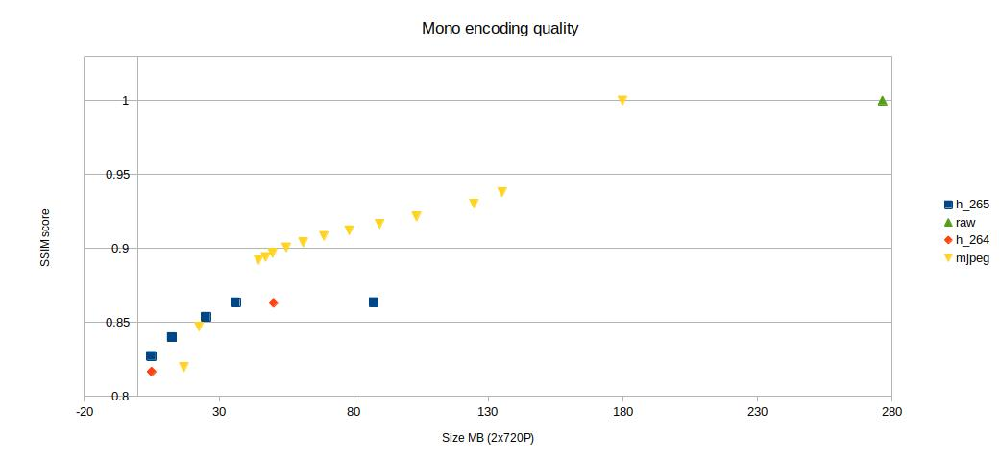
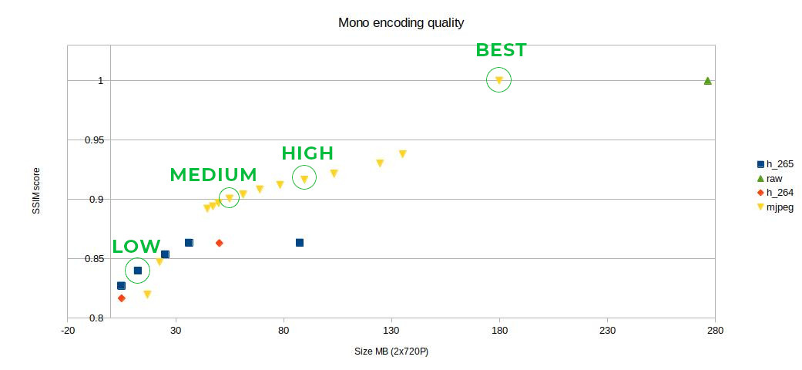

### Encoded mono streams quality

We have been tested how the encoding of mono frames affects the disparity quality. For that, we have recorded raw mono and disparity stream, encoded mono streams with different profiles/quality and then compared the resulting disparity with the raw disparity using [SSIM](https://en.wikipedia.org/wiki/Structural_similarity) from Skimage package.

## Results

The **Y axis** represents the SSIM score, 1 means that disparity from encoded mono stream is identical to raw disparity stream. There is a yellow triangle (MJPEG) that has SSIM score of 1; that is the lossless MJPEG option (`encoder.setLossless(True)`).
The **X axis** represents the size of the 2 mono streams at 720P, 150 frames in total (so 5 seconds of 30FPS footage). Less is better.

So we abstracted these configurations into 4 user options - qualities of encoding - when using `depthai_record` module:

| Quality          | SSIM  | Info                                                 | 4k color | 1080P color | 2x 720P mono | 2x 400P mono |
|------------------|-------|------------------------------------------------------|----------|-------------|--------------|--------------|
| `BEST`           | 100%  | Use the lossless MJPEG, SSIM score of 1              | 186 MB   | 43.4 MB     | 36.1 MB      | 9.6 MB       |
| `HIGH` (default) | 92%   | Uses MJPEG with quality value of 97                  | 101 MB   | 20.5 MB     | 18.6 MB      | 4.5 MB       |
| `MEDIUM`         | 90%   | Uses MJPEG with quality value of 93                  | 62.5 MB  | 11.5 MB     | 9.7 MB       | 3 MB         |
| `LOW`            | 84%   | Uses H265 encoding with bitstream set to 10000 kbps  | 1.3 MB   | 1 MB        | 2.2 MB       | 1.4 MB       |

All file sizes are estimation and will vary a bit case-by-case. **Sizes are for 30 frames** (`-fc 30`) (or 60 for both mono frames). That means that this is approximately how much disk space you will consume each second if you record at 30 FPS. So if you are recording at `HIGH` quality (`-q HIGH`), 1080P (20.5 MB/sec) color and 720P mono (18.6 MB/sec) frames at 30FPS for 5 seconds should result in about `195.5 MB` consumed. From testing (`python3 record.py --save color left right --fps 30 --quality HIGH --frame_cnt 150`), I got `187.5 MB` for the 3 .mjpeg files.

There is also a `.odb` (LibreOffice Calc format) file which contains all the testing results and a chart.
