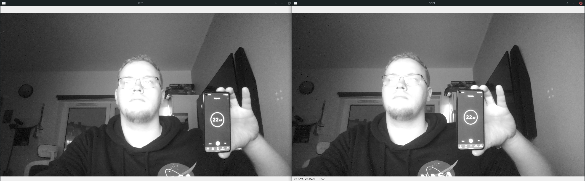

[中文文档](README.zh-CN.md)

# Gen2 Frames Sync

This example demonstrates how to synchronize incoming frames using their sequence numbers. 
This allows displaying frames taken in exact same moment

## Demo



## Pre-requisites

1. Purchase a DepthAI model (see [shop.luxonis.com](https://shop.luxonis.com/))
2. Install requirements
   ```
   python3 -m pip install -r requirements.txt
   ```

## Usage

```
python3 main.py
```

## TODO

- Add color camera stream (waiting for sequence numbers sync between RGB and Mono cameras)