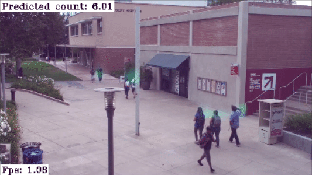

# [Gen3] Crowd Counting with density maps on DepthAI

This example shows an implementation of Crowd Counting with density maps on DepthAI.  We use [DM-Count](https://github.com/cvlab-stonybrook/DM-Count) ([LICENSE](https://github.com/cvlab-stonybrook/DM-Count/blob/master/LICENSE)) model, which has a VGG-19 backbone and is trained on Shanghai B data set.

The model produces density map from which predicted count can be computed.

Input video is resized to 426 x 240 (W x H). Due to a relatively heavy model, the inference speed is around 1 FPS.




Example shows input video with overlay density map input. Example video taken from [VIRAT](https://viratdata.org/) dataset.

## Installation

```
python3 -m pip install -r requirements.txt
python3 download.py
```

## Usage

Run the application

```
python3 main.py

optional arguments:
  -h, --help            show this help message and exit
  -v VIDEO_PATH --video-path VIDEO_PATH
                        Path to the video input for inference. Default: /vids/virat.mp4
```