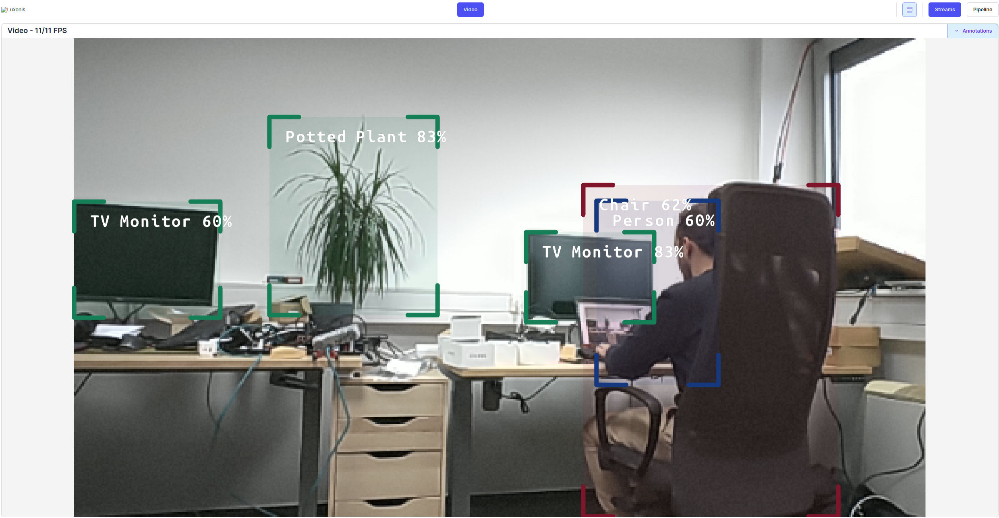
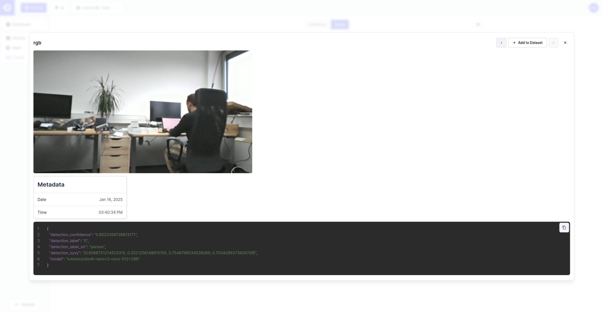

# Hub Snaps & Events

This experiment demonstrates how to create a simple application that sends snaps to [Hub](https://hub.luxonis.com/). This is ideal for constant dataset collection based on some predefined conditions and thus preparing for further tunning of your model. The example is using [YOLOv6 Nano](https://zoo-rvc4.luxonis.com/luxonis/yolov6-nano/face58c4-45ab-42a0-bafc-19f9fee8a034) object detector. The frames where `person` is detected with confidence below 0.7 get sent to Hub as a new snap together with detection metadata. Currently new snap can be generated 1 minute or more after the previous one but this can be configured to better fit your needs. You can see new snaps under [Control/Collect/Snaps](https://hub.luxonis.com/control/collect?view=grid). The experiment works on both RVC2 and RVC4.

## Demo

|             Visualizer view              |         Snap on Hub         |
| :--------------------------------------: | :-------------------------: |
|  |  |

## Usage

Running this example requires a **Luxonis device** connected to your computer. Refer to the [documentation](https://docs.luxonis.com/software-v3/) to setup your device if you haven't done it already.

You can run the experiment fully on device ([`STANDALONE` mode](#standalone-mode-rvc4-only)) or using your computer as host ([`PERIPHERAL` mode](#peripheral-mode)).

Here is a list of all available parameters:

```
-d DEVICE, --device DEVICE
                    Optional name, DeviceID or IP of the camera to connect to. (default: None)
-key API_KEY, --api_key API_KEY
                    HubAI API key of your team. Not required if 'DEPTHAI_HUB_API_KEY' environment variable is set. (default: )
-fps FPS_LIMIT, --fps_limit FPS_LIMIT
                    FPS limit for the model runtime. (default: None)
-media MEDIA_PATH, --media_path MEDIA_PATH
                    Path to the media file you aim to run the model on. If not set, the model will run on the camera input. (default: None)
-thr CONFIDENCE_THRESHOLD, --confidence_threshold CONFIDENCE_THRESHOLD
                    If detection is higher then set confidence then we send the snap. (default: 0.7)
-c CLASS_NAMES [CLASS_NAMES ...], --class_names CLASS_NAMES [CLASS_NAMES ...]
                    Class names to consider. (default: ['person'])
-ti TIME_INTERVAL, --time_interval TIME_INTERVAL
                    Minimum time between snaps. (default: 60.0)
```

## Peripheral Mode

### Installation

You need to first prepare a **Python 3.10** environment with the following packages installed:

- [DepthAI](https://pypi.org/project/depthai/),
- [DepthAI Nodes](https://pypi.org/project/depthai-nodes/).

You can simply install them by running:

```bash
pip install -r requirements.txt
```

Running in peripheral mode requires a host computer and there will be communication between device and host which could affect the overall speed of the app. Below are some examples of how to run the example.

### Examples

```bash
python3 main.py --api_key <API_KEY>
```

This will run the Hub Snaps & Events experiment with the default device and camera input.

## Standalone Mode (RVC4 only)

Running the example in the standalone mode, app runs entirely on the device.
To run the example in this mode, first install the `oakctl` tool using the installation instructions [here](https://docs.luxonis.com/software-v3/oak-apps/oakctl).

Replace `<API_KEY>` with your Hub API key in the [oakapp.toml](oakapp.toml) file.

The app can then be run with:

```bash
oakctl connect <DEVICE_IP>
oakctl app run .
```

This will run the experiment with default argument values. If you want to change these values you need to edit the `oakapp.toml` file (refer [here](https://docs.luxonis.com/software-v3/oak-apps/configuration/) for more information about this configuration file).
