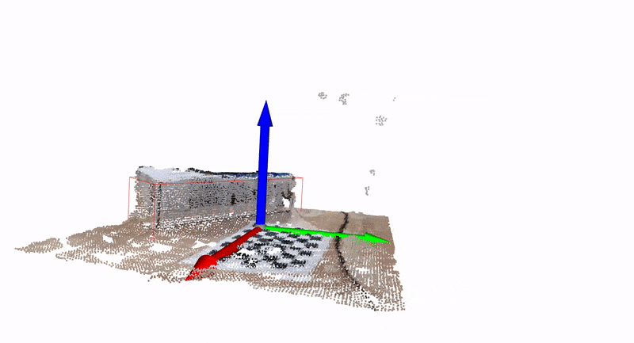

## Box measurement with point cloud fusion
This example demonstrates box measurement on merged point clouds from different cameras.

_For a single camera version check out [box_measurement](https://github.com/luxonis/depthai-experiments/tree/master/box_measurement)._


## Install project requirements
```
python3 -m pip install -r requirements.txt
```
> Note: Running the command above also tries to install open3D which is required for this example. Open3D is not supported by all platforms, but is required for pointcloud visualization.

## Usage
Point your cameras at the box from different angles. Place the calibration board in the middle.
> Before you can run this demo you need to calibrate the cameras. Go to [multi-cam-calibration](../multi-cam-calibration) and generate a calibration file for each camera. Make sure that the `calibration_data_dir` in the [`config.py`](config.py) is set correctly.


Run the [`main.py`](main.py) with Python 3.
```
python3 main.py
```


## Config
In the configuration file [`config.py`](config.py) you can set postprocessing parameters for depth data and point cloud. You might need to change `min_range`, `max_range`, and `point_cloud_range` variables. They specify how much point cloud is kept relative to the calibration board.

