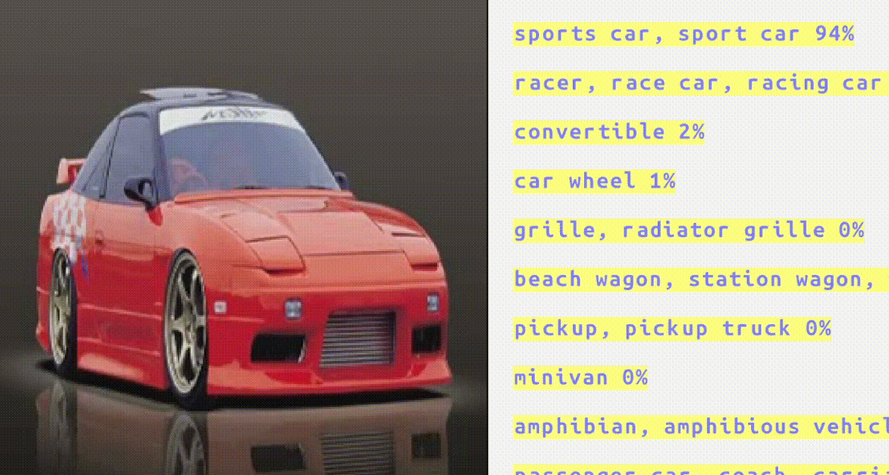
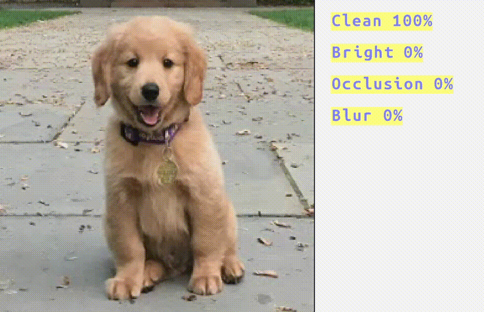
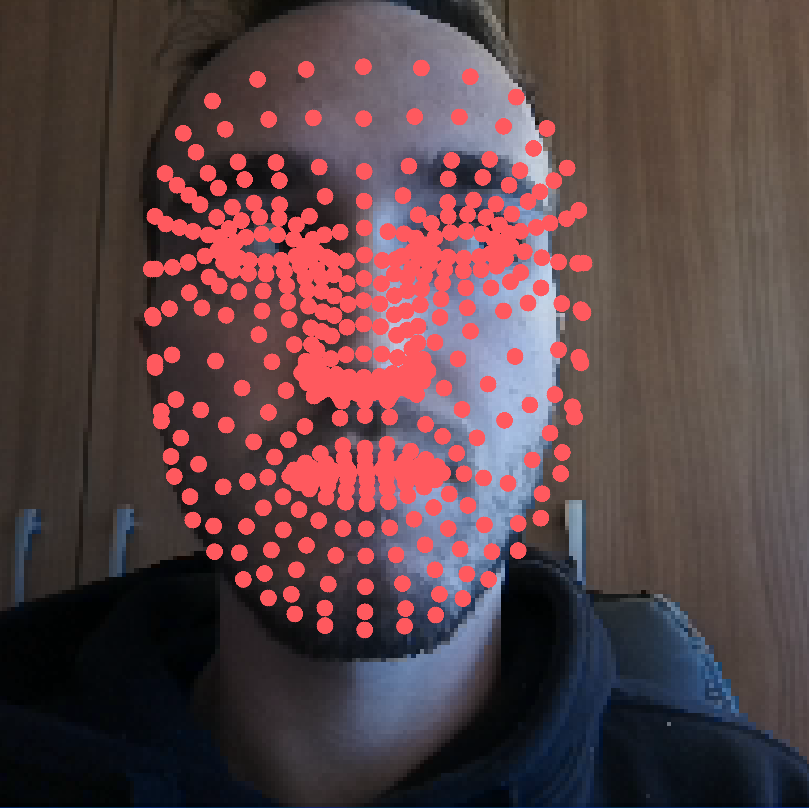
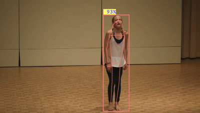
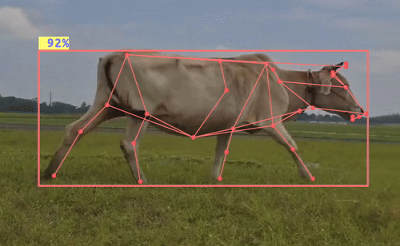
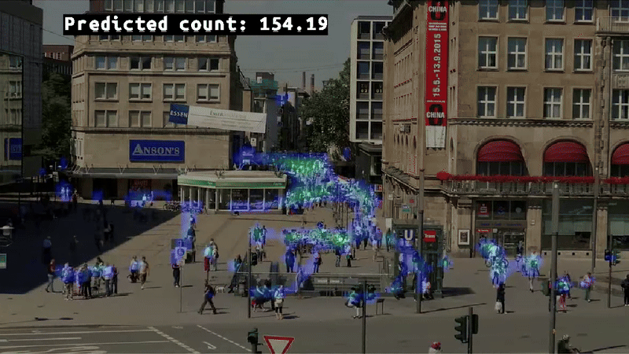
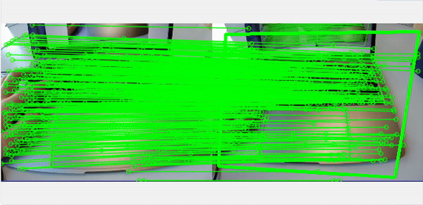

# Overview

This section provides examples to help you get started with **AI model inference** using **DepthAI**.
The examples utilize publicly available models from the [HubAI Model ZOO](https://hub.luxonis.com/ai/models) and can be run on a **Luxonis device** of choice.
The inference is made either on camera inputs or custom media files (image or video) and the results are displayed in the browser.

If not explicitly marked or specified examples can run both on RVC2 and RVC4 devices. Furthermore, RVC4 has the ability to run the experiment in the peripheral or standalone mode. Standalone refers to a mode where the whole application and data are first copied from host to device and then everything is executed on the device, without the need for a host computer. In contrast, peripheral mode requires a direct connection to a host computer and there is device-to-host (or vice versa) communication which can cause lower FPS. You can read more about these two modes [here](https://docs.luxonis.com/software/depthai/standalone).

## Table Of Contents

- [Generic example](generic-example/)
  - This is a special case example. It is not task-dependent and can run a generic inference pipeline for a **single model** with a **single-image input** and a **single-head output**. Its purpose is a quick visualization of simpler models without any additional postprocessing logic. It can serve as a starting point for more complex use cases.
- [Classification](#classification)
- [Object Detection](#object-detection)
- [Face Detection](#face-detection)
- [3D Detection](#3d-detection)
- [Keypoint Detection](#keypoint-detection)
- [Pose Estimation](#pose-estimation)
- [Segmentation](#segmentation)
- [Object Tracking](#object-tracking)
- [Counting](#counting)
- [OCR](#ocr)
- [Reidentification](#reidentification)
- [Depth Estimation](#depth-estimation)
- [Line Detection](#line-detection)
- [Image-to-Image Translation](#image-to-image-translation)
- [Feature Detection](#feature-detection)
- [Speech Recognition](#speech-recognition)

# Examples

LEGEND: ✅: available; ❌: not available; 🚧: work in progress

## Classification

|                                           EfficientNet-lite                                           |                                              Image Quality Assessment                                               |
| :---------------------------------------------------------------------------------------------------: | :-----------------------------------------------------------------------------------------------------------------: |
|  |  |

| Name                                | HubAI Model                                                                                                  | RVC2 | RVC4 (peripheral) | RVC4 (standalone) | Gen2                                                                                                                            | Notes                                |
| ----------------------------------- | ------------------------------------------------------------------------------------------------------------ | ---- | ----------------- | ----------------- | ------------------------------------------------------------------------------------------------------------------------------- | ------------------------------------ |
| [generic-example](generic-example/) | [efficientnet-lite](https://hub.luxonis.com/ai/models/fdacd30d-97f4-4c55-843f-8b7e872d8acb?view=page)        | ✅   | ✅                | ✅                | [gen2-efficientnet-classification](https://github.com/luxonis/depthai-experiments/tree/master/gen2-efficientnet-classification) |                                      |
| [generic-example](generic-example/) | [efficientvit](https://hub.luxonis.com/ai/models/b5481180-538b-4a0d-8f33-28e5b38b4d54?view=page)             | ✅   | ✅                | ✅                |                                                                                                                                 |                                      |
| [generic-example](generic-example/) | [image-quality-assessment](https://hub.luxonis.com/ai/models/1c43753e-5e4d-4d32-b08a-584098290d72?view=page) | ✅   | ❌                | ❌                | [gen2-image-quality-assessment](https://github.com/luxonis/depthai-experiments/tree/master/gen2-image-quality-assessment)       | Model for RVC4 is not yet available. |

## Object Detection

|                                        YoloV6 Nano                                        |                                         YoloP                                         |
| :---------------------------------------------------------------------------------------: | :-----------------------------------------------------------------------------------: |
|  |  |

| Name                                                           | HubAI Model                                                                                                                                                                                                                                                                                           | RVC2 | RVC4 (peripheral) | RVC4 (standalone) | Gen2                                                                                                                                                                                                       | Notes                                                       |
| -------------------------------------------------------------- | ----------------------------------------------------------------------------------------------------------------------------------------------------------------------------------------------------------------------------------------------------------------------------------------------------- | ---- | ----------------- | ----------------- | ---------------------------------------------------------------------------------------------------------------------------------------------------------------------------------------------------------- | ----------------------------------------------------------- |
| [generic-example](generic-example/)                            | [mobilenet-ssd](https://hub.luxonis.com/ai/models/2da6e0a5-4785-488d-8cf5-c35f7ec1a1ed?view=page)                                                                                                                                                                                                     | ✅   | ❌                | ❌                | [gen2-efficientDet](https://github.com/luxonis/depthai-experiments/tree/master/gen2-efficientDet)                                                                                                          | Model not available for RVC4.                               |
| [generic-example](generic-example/)                            | [yolov6-nano](https://hub.luxonis.com/ai/models/face58c4-45ab-42a0-bafc-19f9fee8a034?view=page) / [yolov6-large](https://hub.luxonis.com/ai/models/7937248a-c310-4765-97db-0850086f2dd9?view=page) / [yolov10-nano](https://hub.luxonis.com/ai/models/03153a9a-06f7-4ce9-b655-3762d21d0a8a?view=page) | ✅   | ✅                | ✅                | [gen2-yolo](https://github.com/luxonis/depthai-experiments/tree/master/gen2-yolo)                                                                                                                          |                                                             |
| [generic-example](generic-example/)                            | [qrdet](https://hub.luxonis.com/ai/models/d1183a0f-e9a0-4fa2-8437-f2f5b0181739?view=page)                                                                                                                                                                                                             | ✅   | ✅                | ✅                | [gen2-qr-code-scanner](https://github.com/luxonis/depthai-experiments/tree/master/gen2-qr-code-scanner)                                                                                                    |                                                             |
| [generic-example](generic-example/)                            | [barcode-detection](https://hub.luxonis.com/ai/models/75edea0f-79c9-4091-a48c-f81424b3ccab?view=page)                                                                                                                                                                                                 | ✅   | ✅                | ✅                |                                                                                                                                                                                                            |                                                             |
| [generic-example](generic-example/)                            | [scrfd-person-detection](https://hub.luxonis.com/ai/models/c3830468-3178-4de6-bc09-0543bbe28b1c?view=page)                                                                                                                                                                                            | ✅   | ✅                | ✅                |                                                                                                                                                                                                            |                                                             |
| [generic-example](generic-example/)                            | [mediapipe-palm-detection](https://hub.luxonis.com/ai/models/9531aba9-ef45-4ad3-ae03-808387d61bf3?view=page)                                                                                                                                                                                          | ✅   | ✅                | ✅                | [gen2-palm-detection](https://github.com/luxonis/depthai-experiments/tree/master/gen2-palm-detection)                                                                                                      |                                                             |
| [generic-example](generic-example/)                            | [ppe-detection](https://hub.luxonis.com/ai/models/fd8699bf-3819-4134-9374-3735b9660d3c?view=page)                                                                                                                                                                                                     | ✅   | ✅                | ✅                |                                                                                                                                                                                                            |                                                             |
| [generic-example](generic-example/)                            | [paddle-text-detection](https://hub.luxonis.com/ai/models/131d855c-60b1-4634-a14d-1269bb35dcd2?view=page)                                                                                                                                                                                             | ✅   | ✅                | ✅                |                                                                                                                                                                                                            |                                                             |
| [human-machine-safety](object-detection/human-machine-safety/) | [yolov6-nano](https://hub.luxonis.com/ai/models/face58c4-45ab-42a0-bafc-19f9fee8a034?view=page), [mediapipe-palm-detection](https://hub.luxonis.com/ai/models/9531aba9-ef45-4ad3-ae03-808387d61bf3?view=page)                                                                                         | ✅   | ✅                | ✅                | [gen2-human-machine-safety](https://github.com/luxonis/depthai-experiments/tree/master/gen2-human-machine-safety)                                                                                          | Needs a device with color and stereo (left, right) cameras. |
| [spatial-detections](object-detection/spatial-detections/)     | [yolov6-nano](https://hub.luxonis.com/ai/models/face58c4-45ab-42a0-bafc-19f9fee8a034?view=page) / [yolov6-large](https://hub.luxonis.com/ai/models/7937248a-c310-4765-97db-0850086f2dd9?view=page) / [yolov10-nano](https://hub.luxonis.com/ai/models/03153a9a-06f7-4ce9-b655-3762d21d0a8a?view=page) | ✅   | ✅                | ✅                |                                                                                                                                                                                                            | Needs a device with color and stereo (left, right) cameras. |
| [social-distancing](object-detection/social-distancing/)       | [scrfd-person-detection](https://hub.luxonis.com/ai/models/c3830468-3178-4de6-bc09-0543bbe28b1c?view=page)                                                                                                                                                                                            | ✅   | ✅                | ✅                | [gen2-social-distancing](https://github.com/luxonis/depthai-experiments/tree/master/gen2-social-distancing)                                                                                                | Needs a device with color and stereo (left, right) cameras. |
| [generic-example](generic-example/)                            | [fire-detection](https://hub.luxonis.com/ai/models/899c54a8-9e62-4c99-843d-a51751949a7e?view=page)                                                                                                                                                                                                    | ✅   | ✅                | ✅                | [gen2-fire-detection](https://github.com/luxonis/depthai-experiments/tree/master/gen2-fire-detection)                                                                                                      |                                                             |
| [generic-example](generic-example/)                            | [mobile-object-localizer](https://hub.luxonis.com/ai/models/d7187509-c6c5-4979-9f59-af885011ad2e?view=page)                                                                                                                                                                                           | ✅   | ✅                | ✅                | [gen2-mobile-object-localizer](https://github.com/luxonis/depthai-experiments/tree/master/gen2-mobile-object-localizer)                                                                                    |                                                             |
| [text-blur](object-detection/text-blur/)                       | [paddle-text-detection](https://hub.luxonis.com/ai/models/131d855c-60b1-4634-a14d-1269bb35dcd2?view=page)                                                                                                                                                                                             | ✅   | ✅                | ✅                | [gen2-text-blur](https://github.com/luxonis/depthai-experiments/tree/master/gen2-text-blur)                                                                                                                |                                                             |
| [thermal-detection](object-detection/thermal-detection/)       | [thermal-person-detection](https://hub.luxonis.com/ai/models/b1d7a62f-7020-469c-8fa9-a6d1ff3499b2?view=page)                                                                                                                                                                                          | ✅   | ❌                | ❌                |                                                                                                                                                                                                            | Only available for OAK Thermal(RVC2).                       |
| [yolo-host-decoding](object-detection/yolo-host-decoding/)     | [yolov6-nano](https://hub.luxonis.com/ai/models/face58c4-45ab-42a0-bafc-19f9fee8a034?view=page)                                                                                                                                                                                                       | ✅   | ✅                | ✅                | [gen2-yolo/host-decoding](https://github.com/luxonis/depthai-experiments/tree/master/gen2-yolo/host-decoding)                                                                                              |                                                             |
| [yolo-p](object-detection/yolo-p/)                             | [yolo-p](https://hub.luxonis.com/ai/models/0a22d194-d525-46e7-a785-a267b7958a39?view=page)                                                                                                                                                                                                            | ✅   | ✅                | ✅                | [gen2-yolo/yolop](https://github.com/luxonis/depthai-experiments/tree/master/gen2-yolo/yolop), [gen2-road-segmentation](https://github.com/luxonis/depthai-experiments/tree/master/gen2-road-segmentation) |                                                             |
| [yolo-world](object-detection/yolo-world/)                     | [yolo-world-l](https://hub.luxonis.com/ai/models/6684e96f-11fc-4d92-8657-12a5fd8e532a?view=page)                                                                                                                                                                                                      | ❌   | ✅                | 🚧                |                                                                                                                                                                                                            | Model is only available for RVC4.                           |

## Face Detection

|                                            Blur Faces                                             |                                                     Emotion Recognition                                                      |
| :-----------------------------------------------------------------------------------------------: | :--------------------------------------------------------------------------------------------------------------------------: |
|  |  |

| Name                                                             | HubAI Model                                                                                                                                                                                           | RVC2 | RVC4 (peripheral) | RVC4 (standalone) | Gen2                                                                                                                  | Notes |
| ---------------------------------------------------------------- | ----------------------------------------------------------------------------------------------------------------------------------------------------------------------------------------------------- | ---- | ----------------- | ----------------- | --------------------------------------------------------------------------------------------------------------------- | ----- |
| [generic-example](generic-example/)                              | [yunet](https://hub.luxonis.com/ai/models/5d635f3c-45c0-41d2-8800-7ca3681b1915?view=page)                                                                                                             | ✅   | ✅                | ✅                | [gen2-face-detection](https://github.com/luxonis/depthai-experiments/tree/master/gen2-face-detection)                 |       |
| [generic-example](generic-example/)                              | [scrfd-face-detection](https://hub.luxonis.com/ai/models/1f3d7546-66e4-43a8-8724-2fa27df1096f?view=page)                                                                                              | ✅   | ✅                | ✅                | [gen2-face-detection](https://github.com/luxonis/depthai-experiments/tree/master/gen2-face-detection)                 |       |
| [age-gender](face-detection/age-gender/)                         | [yunet](https://hub.luxonis.com/ai/models/5d635f3c-45c0-41d2-8800-7ca3681b1915?view=page), [age-gender-recognition](https://hub.luxonis.com/ai/models/20cb86d9-1a4b-49e8-91ac-30f4c0a69ce1?view=page) | ✅   | ✅                | ✅                | [gen2-age-gender](https://github.com/luxonis/depthai-experiments/tree/master/gen2-age-gender)                         |       |
| [blur-faces](face-detection/blur-faces/)                         | [yunet](https://hub.luxonis.com/ai/models/5d635f3c-45c0-41d2-8800-7ca3681b1915?view=page)                                                                                                             | ✅   | ✅                | ✅                | [gen2-blur-faces](https://github.com/luxonis/depthai-experiments/tree/master/gen2-blur-faces)                         |       |
| [emotion-recognition](face-detection/emotion-recognition/)       | [yunet](https://hub.luxonis.com/ai/models/5d635f3c-45c0-41d2-8800-7ca3681b1915?view=page), [emotion-recognition](https://hub.luxonis.com/ai/models/3cac7277-2474-4b36-a68e-89ac977366c3?view=page)    | ✅   | ✅                | ✅                | [gen2-emotion-recognition](https://github.com/luxonis/depthai-experiments/tree/master/gen2-emotion-recognition)       |       |
| [fatigue-detection](face-detection/fatigue-detection/)           | [yunet](https://hub.luxonis.com/ai/models/5d635f3c-45c0-41d2-8800-7ca3681b1915?view=page)                                                                                                             | ✅   | ✅                | ✅                | [gen2-fatigue-detection](https://github.com/luxonis/depthai-experiments/tree/master/gen2-fatigue-detection)           |       |
| [gaze-estimation](face-detection/gaze-estimation/)               | [yunet](https://hub.luxonis.com/ai/models/5d635f3c-45c0-41d2-8800-7ca3681b1915?view=page), [gaze-estimation-adas](https://hub.luxonis.com/ai/models/b174ff1b-740b-4016-b8d5-b9488dbdd657?view=page)   | ✅   | ✅                | ✅                | [gen2-gaze-estimation](https://github.com/luxonis/depthai-experiments/tree/master/gen2-gaze-estimation)               |       |
| [head-posture-detection](face-detection/head-posture-detection/) | [yunet](https://hub.luxonis.com/ai/models/5d635f3c-45c0-41d2-8800-7ca3681b1915?view=page), [l2cs-net](https://hub.luxonis.com/ai/models/7051c9d2-78a4-420b-91a8-2d40ecf958dd?view=page)               | ✅   | ✅                | ✅                | [gen2-head-posture-detection](https://github.com/luxonis/depthai-experiments/tree/master/gen2-head-posture-detection) |       |
| [face-mask-detection](face-detection/face-mask-detection/)       | [ppe-detection](https://hub.luxonis.com/ai/models/fd8699bf-3819-4134-9374-3735b9660d3c?view=page)                                                                                                     | ✅   | ✅                | ✅                | [gen2-mask-detection](https://github.com/luxonis/depthai-experiments/tree/master/gen2-mask-detection)                 |       |

## 3D Detection

|                                        Objectron                                         |
| :--------------------------------------------------------------------------------------: |
|  |

| Model                               | RVC2                                                                                                                                                                                           | RVC4 (peripheral) | RVC4 (standalone) | Gen2 | Notes                                                                                       |
| ----------------------------------- | ---------------------------------------------------------------------------------------------------------------------------------------------------------------------------------------------- | ----------------- | ----------------- | ---- | ------------------------------------------------------------------------------------------- |
| [objectron](3D-detection/objectron) | [yolov6-nano](https://hub.luxonis.com/ai/models/face58c4-45ab-42a0-bafc-19f9fee8a034?view=page), [objectron](https://hub.luxonis.com/ai/models/4c7a51db-9cbe-4aee-a4c1-b8abbbe18c11?view=page) | ✅                | ✅                | ✅   | [gen2-objectron](https://github.com/luxonis/depthai-experiments/tree/master/gen2-objectron) |

## Keypoint Detection

|                                               Mediapipe Face Landmarker                                               |
| :-------------------------------------------------------------------------------------------------------------------: |
|  |

| Name                                | HubAI Model                                                                                                   | RVC2 | RVC4 (peripheral) | RVC4 (standalone) | Gen2                                                                                      | Notes |
| ----------------------------------- | ------------------------------------------------------------------------------------------------------------- | ---- | ----------------- | ----------------- | ----------------------------------------------------------------------------------------- | ----- |
| [generic-example](generic-example/) | [mediapipe-face-landmarker](https://hub.luxonis.com/ai/models/4632304b-91cb-4fcb-b4cc-c8c414e13f56?view=page) | ✅   | ✅                | ✅                | [gen2-facemesh](https://github.com/luxonis/depthai-experiments/tree/master/gen2-facemesh) |       |

## Pose Estimation

|                                          Human Pose                                           |                                              Animal Pose                                              |
| :-------------------------------------------------------------------------------------------: | :---------------------------------------------------------------------------------------------------: |
|  |  |

| Name                                        | HubAI Model                                                                                                                                                                                                                        | RVC2 | RVC4 (peripheral) | RVC4 (standalone) | Gen2                                                                                          | Notes |
| ------------------------------------------- | ---------------------------------------------------------------------------------------------------------------------------------------------------------------------------------------------------------------------------------- | ---- | ----------------- | ----------------- | --------------------------------------------------------------------------------------------- | ----- |
| [generic-example](generic-example/)         | [yolov8-nano-pose-estimation](https://hub.luxonis.com/ai/models/12acd8d7-25c0-4a07-9dff-ab8c5fcae7b1?view=page) / [yolov8-large-pose-estimation](https://hub.luxonis.com/ai/models/8be178a0-e643-4f1e-b925-06512e4e15c7?view=page) | ✅   | ✅                | ✅                | [gen2-human-pose](https://github.com/luxonis/depthai-experiments/tree/master/gen2-human-pose) |       |
| [human-pose](pose-estimation/human-pose/)   | [yolov6-nano](https://hub.luxonis.com/ai/models/face58c4-45ab-42a0-bafc-19f9fee8a034?view=page), [lite-hrnet](https://hub.luxonis.com/ai/models/c7c9e353-9f6d-43e1-9b45-8edeae82db70?view=page)                                    | ✅   | ✅                | ✅                | [gen2-human-pose](https://github.com/luxonis/depthai-experiments/tree/master/gen2-human-pose) |       |
| [animal-pose](pose-estimation/animal-pose/) | [yolov6-nano](https://hub.luxonis.com/ai/models/face58c4-45ab-42a0-bafc-19f9fee8a034?view=page), [superanimal-landmarker](https://hub.luxonis.com/ai/models/894cf1a2-23fb-4c96-8944-a0d1be38a7c7?view=page)                        | ✅   | 🚧                | 🚧                |                                                                                               |       |
| [hand-pose](pose-estimation/hand-pose)      | [mediapipe-palm-detection](https://hub.luxonis.com/ai/models/9531aba9-ef45-4ad3-ae03-808387d61bf3?view=page), [mediapipe-hand-landmarker](https://hub.luxonis.com/ai/models/42815cca-deab-4860-b4a9-d44ebbe2988a?view=page)        | ✅   | ✅                | ✅                |                                                                                               |       |

## Segmentation

|                                          YoloV8 Instance Segmentation Nano                                          |                                       FastSam S                                       |
| :-----------------------------------------------------------------------------------------------------------------: | :-----------------------------------------------------------------------------------: |
|  |  |

| Name                                  | HubAI Model                                                                                                                                                                                                                                    | RVC2 | RVC4 (peripheral) | RVC4 (standalone) | Gen2                                                                                                                                                                                                                           | Notes                                                       |
| ------------------------------------- | ---------------------------------------------------------------------------------------------------------------------------------------------------------------------------------------------------------------------------------------------- | ---- | ----------------- | ----------------- | ------------------------------------------------------------------------------------------------------------------------------------------------------------------------------------------------------------------------------ | ----------------------------------------------------------- |
| [generic-example](generic-example/)   | [yolov8-instance-segmentation-nano](https://hub.luxonis.com/ai/models/9c1ea8c4-7ab4-46d2-954b-de237c7b4a05?view=page) / [yolov8-instance-segmentation-large](https://hub.luxonis.com/ai/models/698b881d-2e98-45d0-bc72-1121d2eb2319?view=page) | ✅   | ✅                | ✅                | [gen2-maskrcnn-resnet50](https://github.com/luxonis/depthai-experiments/tree/master/gen2-maskrcnn-resnet50), [gen2-deeplabv3_multiclass](https://github.com/luxonis/depthai-experiments/tree/master/gen2-deeplabv3_multiclass) |                                                             |
| [generic-example](generic-example/)   | [mediapipe-selfie-segmentation](https://hub.luxonis.com/ai/models/dc85210d-5483-4fe2-86aa-16ad5d57d2d1?view=page)                                                                                                                              | ✅   | ✅                | ✅                | [gen2-deeplabv3_person](https://github.com/luxonis/depthai-experiments/tree/master/gen2-deeplabv3_person)                                                                                                                      |                                                             |
| [generic-example](generic-example/)   | [deeplab-v3-plus](https://hub.luxonis.com/ai/models/1189a661-fd0a-44fd-bc9e-64b94d60cb49?view=page)                                                                                                                                            | ✅   | ✅                | ✅                | [gen2-deeplabv3_multiclass](https://github.com/luxonis/depthai-experiments/tree/master/gen2-deeplabv3_multiclass)                                                                                                              |                                                             |
| [generic-example](generic-example/)   | [fastsam-s](https://hub.luxonis.com/ai/models/4af2416c-2ba4-4c85-97d0-fd26f089fc69?view=page)                                                                                                                                                  | ✅   | ✅                | ✅                |                                                                                                                                                                                                                                |                                                             |
| [generic-example](generic-example/)   | [fastsam-x](https://hub.luxonis.com/ai/models/e7d3a0cf-7c1f-4e72-8c0c-9e2fcf53ca24?view=page)                                                                                                                                                  | ❌   | ✅                | ✅                |                                                                                                                                                                                                                                | Model is only available for RVC4.                           |
| [generic-example](generic-example/)   | [ewasr](https://hub.luxonis.com/ai/models/48ca429e-134e-486e-8f71-a8788fb7b510?view=page)                                                                                                                                                      | ✅   | ✅                | ✅                |                                                                                                                                                                                                                                |                                                             |
| [generic-example](generic-example/)   | [pp-liteseg](https://hub.luxonis.com/ai/models/5963005b-eab3-4b68-a24c-45f3b95c6b9d?view=page)                                                                                                                                                 | ✅   | ✅                | ✅                | [gen2-road-segmentation](https://github.com/luxonis/depthai-experiments/tree/master/gen2-road-segmentation)                                                                                                                    |                                                             |
| [depth-crop](segmentation/depth-crop) | [deeplab-v3-plus](https://hub.luxonis.com/ai/models/1189a661-fd0a-44fd-bc9e-64b94d60cb49?view=page)                                                                                                                                            | ✅   | ✅                | ✅                | [gen2-deeplabv3-depth](https://github.com/luxonis/depthai-experiments/tree/master/gen2-deeplabv3_depth)                                                                                                                        | Needs a device with color and stereo (left, right) cameras. |

## Object Tracking

|                                               DeepSORT Tracking                                               |                                             People Tracker                                              |
| :-----------------------------------------------------------------------------------------------------------: | :-----------------------------------------------------------------------------------------------------: |
|  |  |

| Name                                                        | HubAI Model                                                                                                                                                                     | RVC2 | RVC4 (peripheral) | RVC4 (standalone) | Gen2                                                                                                                                | Notes                                                       |
| ----------------------------------------------------------- | ------------------------------------------------------------------------------------------------------------------------------------------------------------------------------- | ---- | ----------------- | ----------------- | ----------------------------------------------------------------------------------------------------------------------------------- | ----------------------------------------------------------- |
| [kalman](object-tracking/kalman/)                           | [yolov6-nano](https://hub.luxonis.com/ai/models/face58c4-45ab-42a0-bafc-19f9fee8a034?view=page)                                                                                 | ✅   | 🚧                | 🚧                | [gen2-bounding-box-filtering/kalman](https://github.com/luxonis/depthai-experiments/tree/master/gen2-bounding-box-filtering/kalman) | Needs a device with color and stereo (left, right) cameras. |
| [collision-avoidance](object-tracking/collision-avoidance/) | [yolov6-nano](https://hub.luxonis.com/ai/models/face58c4-45ab-42a0-bafc-19f9fee8a034?view=page)                                                                                 | ✅   | 🚧                | 🚧                | [gen2-collision-avoidance](https://github.com/luxonis/depthai-experiments/tree/master/collision-avoidance)                          |                                                             |
| [deepsort-tracking](object-tracking/deepsort-tracking/)     | [yolov6-nano](https://hub.luxonis.com/ai/models/face58c4-45ab-42a0-bafc-19f9fee8a034?view=page), [OSNet](https://hub.luxonis.com/ai/models/6d853621-818b-4fa4-bd9a-d9bdcb5616e) | ✅   | ✅                | ✅                | [gen2-deepsort-tracking](https://github.com/luxonis/depthai-experiments/tree/master/gen2-deepsort-tracking)                         |                                                             |
| [people-tracker](object-tracking/people-tracker/)           | [scrfd-person-detection](https://hub.luxonis.com/ai/models/c3830468-3178-4de6-bc09-0543bbe28b1c?view=page)                                                                      | ✅   | 🚧                | 🚧                | [gen2-people-tracker](https://github.com/luxonis/depthai-experiments/tree/master/gen2-people-tracker)                               |                                                             |

## Counting

|                                            Crowd Counting                                             |                                          People Counter                                          |
| :---------------------------------------------------------------------------------------------------: | :----------------------------------------------------------------------------------------------: |
|  |  |

| Name                                                               | HubAI Model                                                                                                | RVC2 | RVC4 (peripheral) | RVC4 (standalone) | Gen2                                                                                                                          | Notes                                |
| ------------------------------------------------------------------ | ---------------------------------------------------------------------------------------------------------- | ---- | ----------------- | ----------------- | ----------------------------------------------------------------------------------------------------------------------------- | ------------------------------------ |
| [crowd-counting](counting/crowdcounting/)                          | [dm-count](https://hub.luxonis.com/ai/models/16d01eab-dc2b-4422-907d-2634a940b52e)                         | ✅   | ✅                | ✅                | [gen2-crowdcounting](https://github.com/luxonis/depthai-experiments/tree/master/gen2-crowdcounting)                           |                                      |
| [cumulative-object-counting](counting/cumulative-object-counting/) | [yolov6-nano](https://hub.luxonis.com/ai/models/face58c4-45ab-42a0-bafc-19f9fee8a034?view=page)            | ✅   | 🚧                | 🚧                | [gen2-cumulative-object-counting](https://github.com/luxonis/depthai-experiments/tree/master/gen2-cumulative-object-counting) |                                      |
| [depth-people-counting](counting/depth-people-counting/)           |                                                                                                            | 🚧   | 🚧                | 🚧                | [gen2-depth-people-counting](https://github.com/luxonis/depthai-experiments/tree/master/gen2-depth-people-counting)           | Experiment does not use any NN model |
| [people-counter](counting/people-counter/)                         | [scrfd-person-detection](https://hub.luxonis.com/ai/models/c3830468-3178-4de6-bc09-0543bbe28b1c?view=page) | ✅   | ✅                | ✅                | [gen2-people-counter](https://github.com/luxonis/depthai-experiments/tree/master/gen2-people-counter)                         |                                      |

## OCR

|                                           License Plate Recognition                                           |
| :-----------------------------------------------------------------------------------------------------------: |
|  |

| Name                                                        | HubAI Model                                                                                                                                                                                                                                                                                                               | RVC2 | RVC4 (peripheral) | RVC4 (standalone) | Gen2                                                                                                                                                                                                         | Notes |
| ----------------------------------------------------------- | ------------------------------------------------------------------------------------------------------------------------------------------------------------------------------------------------------------------------------------------------------------------------------------------------------------------------- | ---- | ----------------- | ----------------- | ------------------------------------------------------------------------------------------------------------------------------------------------------------------------------------------------------------ | ----- |
| [license-plate-recognition](ocr/license-plate-recognition/) | [yolov6-nano](https://hub.luxonis.com/ai/models/face58c4-45ab-42a0-bafc-19f9fee8a034?view=page), [license-plate-detection](https://hub.luxonis.com/ai/models/7ded2dab-25b4-4998-9462-cba2fcc6c5ef?view=page), [paddle-text-recognition](https://hub.luxonis.com/ai/models/9ae12b58-3551-49b1-af22-721ba4bcf269?view=page) | 🚧   | ✅                | ✅                | [gen2-license-plate-recognition](https://github.com/luxonis/depthai-experiments/tree/master/gen2-license-plate-recognition)                                                                                  |       |
| [general-ocr](ocr/general-ocr/)                             | [paddle-text-detection](https://hub.luxonis.com/ai/models/131d855c-60b1-4634-a14d-1269bb35dcd2?view=page), [paddle-text-recognition](https://hub.luxonis.com/ai/models/9ae12b58-3551-49b1-af22-721ba4bcf269?view=page)                                                                                                    | ✅   | ✅                | ✅                | [gen2-ocr](https://github.com/luxonis/depthai-experiments/tree/master/gen2-ocr), [gen2-seven-segment-recognition](https://github.com/luxonis/depthai-experiments/tree/master/gen2-seven-segment-recognition) |       |

## Reidentification

|                                                  Human Reidentification (Pose)                                                   |                                                  Human Reidentification (Face)                                                   |
| :------------------------------------------------------------------------------------------------------------------------------: | :------------------------------------------------------------------------------------------------------------------------------: |
|  |  |

| Name                                                               | HubAI Model                                                                                                                                                                                                                                                                                                                                                                                                                                                                                          | RVC2 | RVC4 (peripheral) | RVC4 (standalone) | Gen2                                                                                                                                                                                                                                       | Notes |
| ------------------------------------------------------------------ | ---------------------------------------------------------------------------------------------------------------------------------------------------------------------------------------------------------------------------------------------------------------------------------------------------------------------------------------------------------------------------------------------------------------------------------------------------------------------------------------------------- | ---- | ----------------- | ----------------- | ------------------------------------------------------------------------------------------------------------------------------------------------------------------------------------------------------------------------------------------ | ----- |
| [human-reidentification](reidentification/human-reidentification/) | [scrfd-person-detection](https://hub.luxonis.com/ai/models/c3830468-3178-4de6-bc09-0543bbe28b1c?view=page)/[scrfd-face-detection](https://hub.luxonis.com/ai/models/1f3d7546-66e4-43a8-8724-2fa27df1096f?view=page)/[yunet](https://hub.luxonis.com/ai/models/5d635f3c-45c0-41d2-8800-7ca3681b1915?view=page), [osnet](https://hub.luxonis.com/ai/models/6d853621-818b-4fa4-bd9a-d9bdcb5616e6?view=page)/[arcface](https://hub.luxonis.com/ai/models/e24a577e-e2ff-4e4f-96b7-4afb63155eac?view=page) | ✅   | ✅                | ✅                | [gen2-pedestrian-reidentification](https://github.com/luxonis/depthai-experiments/tree/master/gen2-pedestrian-reidentification), [gen2-face-recognition](https://github.com/luxonis/depthai-experiments/tree/master/gen2-face-recognition) |       |

## Depth Estimation

|                                           CREStereo Stereo Matching                                           |                                      MiDaS v2.1                                       |
| :-----------------------------------------------------------------------------------------------------------: | :-----------------------------------------------------------------------------------: |
|  |  |

| Name                                                                                            | HubAI Model                                                                                           | RVC2 | RVC4 (peripheral) | RVC4 (standalone) | Gen2                                                                                                                                                                                                                                                                                          | Notes                             |
| ----------------------------------------------------------------------------------------------- | ----------------------------------------------------------------------------------------------------- | ---- | ----------------- | ----------------- | --------------------------------------------------------------------------------------------------------------------------------------------------------------------------------------------------------------------------------------------------------------------------------------------- | --------------------------------- |
| [crestereo-stereo-matching](neural-stereo-matching/depth-estimation/crestereo-stereo-matching/) | [crestereo](https://hub.luxonis.com/ai/models/4729a8bd-54df-467a-92ca-a8a5e70b52ab?view=page)         | ✅   | 🚧                | 🚧                | [gen2-crestereo-stereo-matching](https://github.com/luxonis/depthai-experiments/tree/master/gen2-crestereo-stereo-matching)                                                                                                                                                                   |                                   |
| [generic-example](generic-example/)                                                             | [midas-v2-1](https://hub.luxonis.com/ai/models/be09b09e-053d-4330-a0fc-0c9d16aac007?view=page)        | ✅   | ✅                | ✅                | [gen2-depth-mbnv2](https://github.com/luxonis/depthai-experiments/tree/master/gen2-depth-mbnv2), [gen2-fast-depth](https://github.com/luxonis/depthai-experiments/tree/master/gen2-fast-depth), [gen2-mega-depth](https://github.com/luxonis/depthai-experiments/tree/master/gen2-mega-depth) |                                   |
| [generic-example](generic-example/)                                                             | [depth-anything-v2](https://hub.luxonis.com/ai/models/c5bf9763-d29d-4b10-8642-fbd032236383?view=page) | ❌   | ✅                | ✅                |                                                                                                                                                                                                                                                                                               | Model is only available for RVC4. |

## Line Detection

|                                       M-LSD                                       |                                       Ultra Fast Lane Detection                                       |
| :-------------------------------------------------------------------------------: | :---------------------------------------------------------------------------------------------------: |
|  |  |

| Name                                | HubAI Model                                                                                                   | RVC2 | RVC4 (peripheral) | RVC4 (standalone) | Gen2                                                                                    | Notes                             |
| ----------------------------------- | ------------------------------------------------------------------------------------------------------------- | ---- | ----------------- | ----------------- | --------------------------------------------------------------------------------------- | --------------------------------- |
| [generic-example](generic-example/) | [m-lsd](https://hub.luxonis.com/ai/models/9e3e01d8-2303-4113-bf69-cb10ec56ad5b?view=page)                     | ✅   | ✅                | ✅                |                                                                                         |                                   |
| [generic-example](generic-example/) | [m-lsd-tiny](https://hub.luxonis.com/ai/models/1d879fef-2c5a-46f4-9077-fa99e29f79d8?view=page)                | ✅   | ❌                | ❌                |                                                                                         | Model is only available for RVC2. |
| [generic-example](generic-example/) | [ultra-fast-lane-detection](https://hub.luxonis.com/ai/models/b15d067f-2cde-48a0-85bf-52e1174b1ac0?view=page) | ✅   | ✅                | ✅                | [gen2-lanenet](https://github.com/luxonis/depthai-experiments/tree/master/gen2-lanenet) |                                   |

## Image-to-Image Translation

| Name                                | HubAI Model                                                                                             | RVC2 | RVC4 (peripheral) | RVC4 (standalone) | Gen2 | Notes                                               |
| ----------------------------------- | ------------------------------------------------------------------------------------------------------- | ---- | ----------------- | ----------------- | ---- | --------------------------------------------------- |
| [generic-example](generic-example/) | [zero-dce](https://hub.luxonis.com/ai/models/8eaae754-6195-4766-a39c-2d19a856a492?view=page)            | ✅   | ✅                | ✅                |      |                                                     |
| [generic-example](generic-example/) | [rt-super-resolution](https://hub.luxonis.com/ai/models/536a03d9-4901-4a4d-ab7a-0e12c472c48e?view=page) | ✅   | ✅                | ✅                |      |                                                     |
| [generic-example](generic-example/) | [esrgan](https://hub.luxonis.com/ai/models/0180f69d-04e7-4511-9d36-30c488b017ee?view=page)              | ❌   | ✅                | ✅                |      | Missing visualizations.                             |
| [generic-example](generic-example/) | [dncnn3](https://hub.luxonis.com/ai/models/89c61463-1074-4f31-907f-751a83a9643a?view=page)              | ✅   | ✅                | ✅                |      | Missing visualization, model needs grayscale input. |

## Feature Detection

|                                           XFeat                                            |
| :----------------------------------------------------------------------------------------: |
|  |

| Name                              | HubAI Model                                                                               | RVC2 | RVC4 (peripheral) | RVC4 (standalone) | Gen2 | Notes                                                |
| --------------------------------- | ----------------------------------------------------------------------------------------- | ---- | ----------------- | ----------------- | ---- | ---------------------------------------------------- |
| [xfeat](feature-detection/xfeat/) | [xfeat](https://hub.luxonis.com/ai/models/6c2790a1-bf68-4e89-a4b3-5c9ae68183b5?view=page) | ✅   | ✅                | ✅                |      | Needs a device with stereo (left and right) cameras. |

## Speech Recognition

| Name                                                   | HubAI Model                                                                                         | RVC2 | RVC4 (peripheral) | RVC4 (standalone) | Gen2 | Notes                            |
| ------------------------------------------------------ | --------------------------------------------------------------------------------------------------- | ---- | ----------------- | ----------------- | ---- | -------------------------------- |
| [whisper-tiny-en](speech-recognition/whisper-tiny-en/) | [whisper-tiny-en](https://hub.luxonis.com/ai/models/0aaf1b77-761b-44d6-893c-c473ca463186?view=page) | ❌   | ✅                | ✅                |      | Model is only available for RVC4 |
