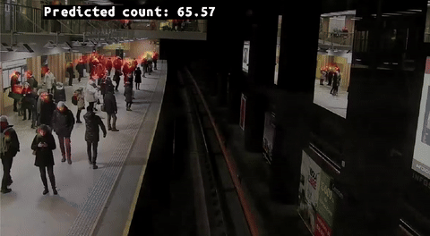

# Overview

This experiment demonstrates how to build a DepthAI pipeline for crowd counting. 
We use [DM-Count](https://hub.luxonis.com/ai/models/16d01eab-dc2b-4422-907d-2634a940b52e?view=page) model to produce a crowd density map from which the count is computed.

## Demo

[](media/crowd-counting.gif)

<sup>[Source](hhttps://www.pexels.com/video/time-lapse-video-of-people-at-subway-station-855749/)</sup>

## Installation

Running this example requires a **Luxonis OAK device** connected to your computer. You can find more information about the supported devices and the set up instructions in our [Documentation](https://rvc4.docs.luxonis.com/hardware).
Moreover, you need to prepare a **Python 3.10** environment with [DepthAI](https://pypi.org/project/depthai/) and [DepthAI Nodes](https://pypi.org/project/depthai-nodes/) packages installed. You can do this by running:

```bash
pip install -r requirements.txt
```

## Usage

You can run the experiment fully on device (`STANDALONE` mode) or using your your computer as host (`PERIPHERAL` mode).

### Peripheral Mode

```bash
python3 main.py -model <MODEL> -media <MEDIA> -fps <FPS_LIMIT> --device <DEVICE>
```

- `<MODEL>`: DM-Count model variant reference from Luxonis HubAI.
- `<MEDIA>` \[OPTIONAL\]: Path to the video file. Default: `None` - use camera input.
- `<FPS_LIMIT>` \[OPTIONAL\]: Limit of the video/camera FPS. Beware that if providing a video file with higher FPS, a slowed-down video will be shown (and vice-versa if providing a video file with higher FPS). Default: `1`.
- `<DEVICE>` \[OPTIONAL\]: Device IP or ID. Default: `None` - use the first identified device connected to the host.

#### Examples

```bash
python main.py \
    -model luxonis/dm-count:shb-426x240 \
    -fps 5
```

This will run the experiment using the SHB variant of the model with input size 426x240 on the default device and camera input at 5 FPS.


### Standalone Mode

Running the experiment in the [Standalone mode](https://rvc4.docs.luxonis.com/software/depthai/standalone/) runs the app entirely on the device.
To run the example in this mode, first install the [oakctl](https://rvc4.docs.luxonis.com/software/tools/oakctl/) command-line tool (enables host-device interaction) as:

```bash
bash -c "$(curl -fsSL https://oakctl-releases.luxonis.com/oakctl-installer.sh)"
```

The app can then be run with:

```bash
oakctl connect <DEVICE_IP>
oakctl app run .
```

This will run the experiment using the SHB variant of the model with input size 426x240 on the specified device and camera input at 5 FPS.