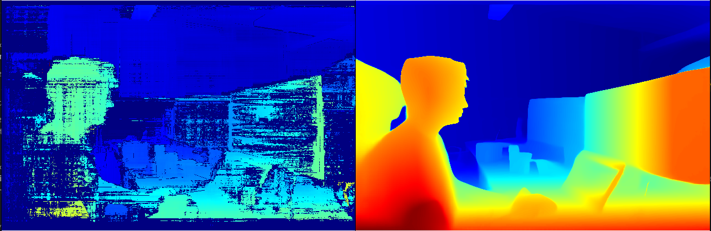
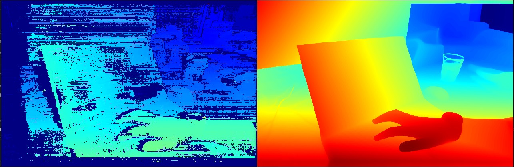

# Stereo ONNX Depth Experiment

This experiment shows how to generate Foundation Stereo with OAK devices, comparing with the disparity
directly from the DepthAI stereo node. The ONNX model is executed on a host computer. The resolution and speed of inference are configurable.

## Demo

[](media/img1.png)
[](media/img2.png)

## Installation

Prepare your Python environment by installing the required packages:

```bash
pip install -r requirements.txt
```

Download the ONNX model:

*TODO*

Ensure the required ONNX model file is available and the path is provided as an argument when running the application.

## Requirements

For running the model on **GPU**:
- for resolution 400 the model requires at least 6GB of VRAM
- for resolution 800 the model requires at least 12GB of VRAM

It is possible to run the model on **CPU**, but the generation is significantly slower.

## Usage

The experiment is run in host (Peripheral) mode, using a computer for ONNX inference while the DepthAI device captures and streams image data.

Here are the available parameters:

```
-m ONNX_MODEL_PATH, --model ONNX_MODEL_PATH
                    Path to the ONNX model (default: models/foundation_stereo_640x416_32.onnx).
-d DEVICE, --device DEVICE
                    Optional IP address of the camera to connect to (default: None).
-r {400,800}, --resolution {400,800}
                    Resolution mode for camera input (default: 400 for 640x400).
-fps FPS_LIMIT, --fps_limit FPS_LIMIT
                    FPS limit for the model runtime (default: 15).
```

### Peripheral Mode

Below are examples for running the experiment:

#### Examples

Run the experiment with default arguments:

```bash
python3 main.py
```

Run the experiment with a specific model file:

```bash
python3 main.py -m model.onnx
```

Run the experiment with a higher resolution (1280x800) and custom FPS:

```bash
python3 main.py -m model.onnx --resolution 800 --fps_limit 5
```

Connect to a specific DepthAI device by IP address:

```bash
python3 main.py -m model.onnx --device 192.168.1.2
```

## Controls During Execution

* Press `F` to generate and display Foundation Stereo Disparity using the ONNX model.
* Press `Q` to exit the application.


