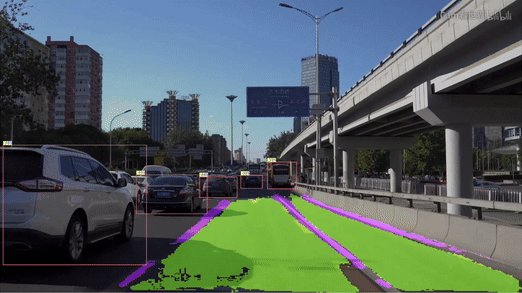

# YOLO-P

This experiment shows an implementation of [YOLO-P](https://zoo-rvc4.luxonis.com/luxonis/yolo-p/0a22d194-d525-46e7-a785-a267b7958a39) from our HubAI. It shows that YOLO-P can be run as a ADAS (advanced driving assistance system) on DepthAI. It can detect vehicles, segment road and lines.

Input shape of the model is 320 x 320, and we resize the input video to the required shape.

## Demo



Example shows input video with overlay of lane and line segmentation and vehicle detections. Example video is taken from [YOLOP repository](https://github.com/hustvl/YOLOP/tree/main/inference/videos).

## Usage

Running this example requires a **Luxonis device** connected to your computer. Refer to the [documentation](https://stg.docs.luxonis.com/software/) to setup your device if you haven't done it already.

You can run the experiment fully on device ([`STANDALONE` mode](#standalone-mode-rvc4-only)) or using your your computer as host ([`PERIPHERAL` mode](#peripheral-mode)).

Here is a list of all available parameters:

```
-d DEVICE, --device DEVICE
                    Optional name, DeviceID or IP of the camera to connect to. (default: None)
-fps FPS_LIMIT, --fps_limit FPS_LIMIT
                    FPS limit for the model runtime. (default: 8 for both RVC2 and RVC4)
-media MEDIA_PATH, --media_path MEDIA_PATH
                    Path to the media file you aim to run the model on. If not set, the model will run on the camera input. (default: None)
```

## Peripheral Mode

### Installation

You need to first prepare a **Python 3.10** environment with the following packages installed:

- [DepthAI](https://pypi.org/project/depthai/),
- [DepthAI Nodes](https://pypi.org/project/depthai-nodes/).

You can simply install them by running:

```bash
pip install -r requirements.txt
```

Running in peripheral mode requires a host computer and there will be communication between device and host which could affect the overall speed of the app. Below are some examples of how to run the example.

### Examples

```bash
python3 main.py
```

This will run the YOLOP experiment with the default device, and camera input.

```bash
python3 main.py --media <PATH_TO_VIDEO>
```

This will run the YOLOP experiment with the default device and the video file.

## Standalone Mode (RVC4 only)

Running the example in the standalone mode, app runs entirely on the device.
To run the example in this mode, first install the `oakctl` tool using the installation instructions [here](https://stg.docs.luxonis.com/software/oak-apps/oakctl).

The app can then be run with:

```bash
oakctl connect <DEVICE_IP>
oakctl app run .
```

This will run the experiment with default argument values. If you want to change these values you need to edit the `oakapp.toml` file (refer [here](https://stg.docs.luxonis.com/software/oak-apps/configuration/) for more information about this configuration file).
