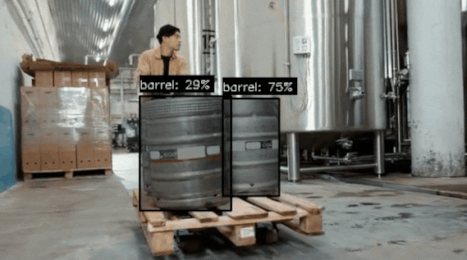

# Multi-Input YOLO World Demo README

This example demonstrates the implementation of multi-input [YOLO-World](https://models.luxonis.com/luxonis/yolo-world-l/6684e96f-11fc-4d92-8657-12a5fd8e532a) object detection pipeline on DepthAI. It can detect objects in real-time using YOLO, has support for video files and live camera input, and is customizable with class names and confidence threshold.

**NOTE:** This example works only on `RVC4` devices.

## Demo



## Usage

Running this example requires a **Luxonis device** connected to your computer. Refer to the [documentation](https://docs.luxonis.com/software-v3/) to setup your device if you haven't done it already.

You can run the example fully on device ([`STANDALONE` mode](#standalone-mode-rvc4-only)) or using your computer as host ([`PERIPHERAL` mode](#peripheral-mode)).

Here is a list of all available parameters:

```
-d DEVICE, --device DEVICE
                     Optional name, DeviceID or IP of the camera to connect to. (default: None)
-fps FPS_LIMIT, --fps_limit FPS_LIMIT
                      FPS limit for the model runtime. (default: 5)
-media MEDIA_PATH, --media_path MEDIA_PATH
                     Path to the media file you aim to run the model on. If not set, the model will run on the camera input. (default: None)
-c CLASS_NAMES [CLASS_NAMES ...], --class_names CLASS_NAMES [CLASS_NAMES ...]
                     Class names to be detected (default: ['person', 'chair', 'TV'])
-conf CONFIDENCE_THRESH, --confidence_thresh CONFIDENCE_THRESH
                     Sets the confidence threshold (default: 0.1)
```

## Peripheral Mode

### Installation

You need to first prepare a **Python 3.10** environment with the following packages installed:

- [DepthAI](https://pypi.org/project/depthai/),
- [DepthAI Nodes](https://pypi.org/project/depthai-nodes/).

You can simply install them by running:

```bash
pip install -r requirements.txt
```

Running in peripheral mode requires a host computer and there will be communication between device and host which could affect the overall speed of the app. Below are some examples of how to run the example.

### Examples

```bash
python main.py --class_names person car dog --confidence_thresh 0.2
```

This will run the example by detecting `person`, `car` and `dog` classes using 0.2 as confidence threshold.

## Standalone Mode (RVC4 only)

Running the example in the standalone mode, app runs entirely on the device.
To run the example in this mode, first install the `oakctl` tool using the installation instructions [here](https://docs.luxonis.com/software-v3/oak-apps/oakctl).

The app can then be run with:

```bash
oakctl connect <DEVICE_IP>
oakctl app run .
```

This will run the example with default argument values. If you want to change these values you need to edit the `oakapp.toml` file (refer [here](https://docs.luxonis.com/software-v3/oak-apps/configuration/) for more information about this configuration file).
