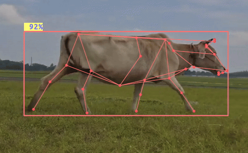

# Animal detection and pose estimation

This experiment demonstrates how to build a 2-stage DepthAI pipeline for detecting animals and estimating their poses. The pipeline consists of [YOLOv6](https://hub.luxonis.com/ai/models/face58c4-45ab-42a0-bafc-19f9fee8a034?view=page) object detector and [SuperAnimal](https://hub.luxonis.com/ai/models/894cf1a2-23fb-4c96-8944-a0d1be38a7c7?view=page) pose estimation model. The experiment works on both RVC2 and RVC4. For realtime application you will need to use OAK4 cameras.

## Demo

[](media/cow-walking.gif)

<sup>[Source](https://www.youtube.com/shorts/LGof_auMHuc)</sup>

## Installation

You need to prepare a Python environment with [DepthAI](https://pypi.org/project/depthai/) and [DepthAI Nodes](https://pypi.org/project/depthai-nodes/) packages installed. You can do this by running:

```bash
pip install -r requirements.txt
```

## Usage

You can run the experiment fully on device (`STANDALONE` mode) or using your your computer as host (`PERIPHERAL` mode).

### Peripheral Mode

```bash
python3 main.py --device <DEVICE> --media <MEDIA> --fps_limit <FPS_LIMIT>
```

- `<DEVICE>`: Device IP or ID. Default: \`\`.
- `<MEDIA>`: Path to the video file. Default `None` - camera input.
- `<FPS_LIMIT>`: Limit of the camera FPS. Default: `30`.

#### Examples

```bash
python3 main.py
```

This will run the animal detection and pose estimation experiment with the default device and camera input.

```bash
python3 main.py --media <PATH_TO_VIDEO>
```

This will run the animal detection and pose estimation experiment with the default device and the video file.

```bash
python3 main.py --device <DEVICE IP OR MXID>
```

This will run the animal detection and pose estimation experiment with the specified device and camera input.

### Standalone Mode

Running the experiment in the [Standalone mode](https://rvc4.docs.luxonis.com/software/depthai/standalone/) runs the app entirely on the device.
To run the example in this mode, first install the [oakctl](https://rvc4.docs.luxonis.com/software/tools/oakctl/) command-line tool (enables host-device interaction) as:

```bash
bash -c "$(curl -fsSL https://oakctl-releases.luxonis.com/oakctl-installer.sh)"
```

and run the example using the `run_standalone.py` script:

```bash
python3 run_standalone.py \
    --device <Device> \
    --fps_limit <FPS> \
    --media <MEDIA>
```

The arguments are the same as in the Peripheral mode.

#### Example

```bash
python3 run_standalone.py \
    --device <DEVICE IP> \
    --fps_limit 28 \
```
