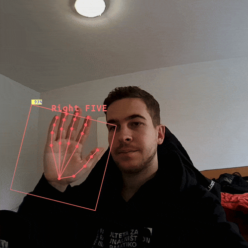

# Hand pose estimation

This experiment demonstrates how to build a 2-stage DepthAI pipeline for hand pose estimation. The pipeline consists of [MediaPipe Palm detector](https://hub.luxonis.com/ai/models/9531aba9-ef45-4ad3-ae03-808387d61bf3?view=page) and [MediaPipe Hand landmarker](https://hub.luxonis.com/ai/models/42815cca-deab-4860-b4a9-d44ebbe2988a?view=page). The experiment works on both RVC2 and RVC4. For realtime application you will need to use OAK4 cameras.

By default FPS limit for RVC2 is 6FPS and for RVC4 is 30FPS. You can change this value by setting the `fps_limit` parameter.

After the pose estimation we also apply some logic to recognize the hand gestures. The gestures are: FIST, OK, PEACE, ONE, TWO, THREE, FOUR, and FIVE.

## Demo

[](media/hand-pose.gif)

## Installation

You need to prepare a Python environment with [DepthAI](https://pypi.org/project/depthai/) and [DepthAI Nodes](https://pypi.org/project/depthai-nodes/) packages installed. You can do this by running:

```bash
pip install -r requirements.txt
```

## Usage

You can run the experiment fully on device (`STANDALONE` mode) or using your your computer as host (`PERIPHERAL` mode).

Here is a list of all available parameters:

```
-d DEVICE, --device DEVICE
                    Optional name, DeviceID or IP of the camera to connect to. (default: None)
-fps FPS_LIMIT, --fps_limit FPS_LIMIT
                    FPS limit for the model runtime. (default: 30.0 for RVC4, 6.0 for RVC2)
-media MEDIA_PATH, --media_path MEDIA_PATH
                    Path to the media file you aim to run the model on. If not set, the model will run on the camera input. (default: None)
```

### Peripheral Mode

Running in peripheral mode requires a host computer and there will be communication between device and host which could affect the overall speed of the app. Below are some examples of how to run the example.

#### Examples

```bash
python3 main.py
```

This will run the hand pose estimation experiment with the default device and camera input.

```bash
python3 main.py --media <PATH_TO_VIDEO>
```

This will run the hand pose estimation experiment with the default device and the video file.

```bash
python3 main.py --fps_limit 5
```

This will run the hand pose estimation experiment with the default device and camera input and a `5` FPS limit.

### Standalone Mode

Running the experiment in the [Standalone mode](https://rvc4.docs.luxonis.com/software/depthai/standalone/) runs the app entirely on the device.
To run the example in this mode, first install the [oakctl](https://rvc4.docs.luxonis.com/software/tools/oakctl/) command-line tool (enables host-device interaction) as:

```bash
bash -c "$(curl -fsSL https://oakctl-releases.luxonis.com/oakctl-installer.sh)"
```

The app can then be run with:

```bash
oakctl connect <DEVICE_IP>
oakctl app run .
```

This will run the experiment with default argument values. If you want to change these values you need to edit the `oakapp.toml` file.
