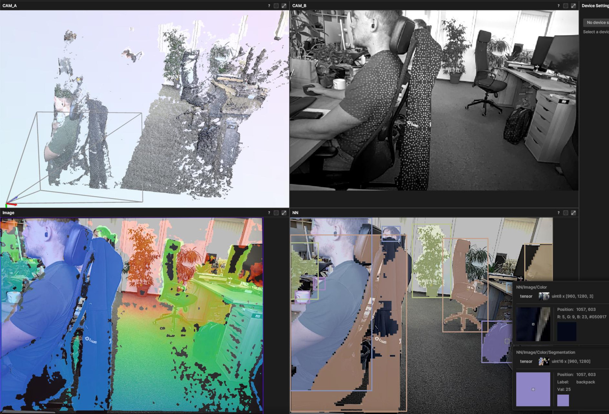

# YOLOv8 Instance Segmentation

This demo runs [yolov8-instance-segmentation-large:coco-640x480](https://hub.luxonis.com/ai/models/698b881d-2e98-45d0-bc72-1121d2eb2319) AI model on color stream, which is aligned with 3D stereo depth stream.

It runs on [OAK4 D](https://shop.luxonis.com/products/oak-4-d-ea) camera, as it requires RVC4 chip for NN inferencing.



## Installation

```
python3 -m pip install -r requirements.txt
```

## Usage

Run the application.

```
python3 main.py
```
