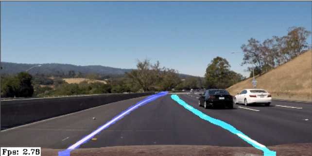

## LaneNet

This example shows an implementation of [LaneNet](https://arxiv.org/pdf/1802.05591.pdf) using DepthAI SDK.
Model is pretrained on TuSimple dataset.
It is taken from [PINTO's Model ZOO](https://github.com/PINTO0309/PINTO_model_zoo/tree/main/141_lanenet-lane-detection)
and converted with model optimizer so that no additional preprocessing is need.

Input video is resized to 512x256 (W x H). The inference speed is around 2-4 FPS.



Example video is taken from [here](https://github.com/udacity/CarND-LaneLines-P1).

### Output and postprocessing

The model produces two outputs - *(1)* binary segmentation mask where 1 represents line and *(2)* embeddings of
dimension 4 for each pixel. Note that our post-processing differs from the original post-processing
in [LaneNet](https://arxiv.org/pdf/1802.05591.pdf), and was made just to showcase the model on the DepthAI.

We currently perform DBSCAN clustering of embeddings, which were sorted using Numpy's lexsort. This works OK and lanes
are usually allocated to the same cluster during different frames, as long as no new line is detected on the left side
of the leftmost line. For proper post-processing please refer to [LaneNet](https://arxiv.org/pdf/1802.05591.pdf) paper.

## Pre-requisites

1. Download sample videos.
   ```
   python3 download.py
   ```
2. Install requirements.
   ```
   python3 -m pip install -r requirements.txt
   ```

## Usage

```
python3 main.py
```