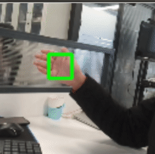

[中文文档](README.zh-CN.md)

Palm detection
================

This example demonstrates
[palm detection network](https://google.github.io/mediapipe/solutions/hands#palm-detection-model) using DepthAI SDK.  

## Demo


--------------------

## Pre-requisites

Install requirements:
```bash
python3 -m pip install -r requirements.txt
```


## Usage

```bash
python main.py
```