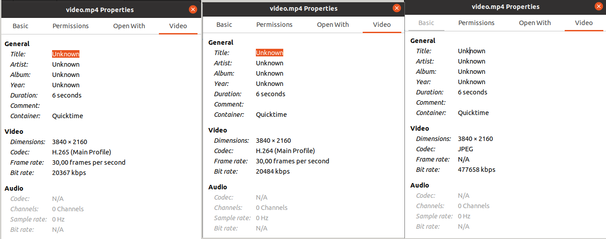

# On Device Encoding

This experiment demonstrates how to stream encoded frames from the device to the host and save them directly into a video container. **Video is encoded on the device itself** before it's sent to the host computer.

This demo uses codecs that some video players (eg. Quicktime) might not support. We suggest using [VLC](https://www.videolan.org/vlc/) to play the video.

## Demo



As you can see, the `video.mp4` uses the codec of the stream being saved, so there's no decoding/encoding (or converting) happening on the host computer and **host CPU/GPU/RAM usage is minimal**.

## Installation

```
python3 -m pip install -r requirements.txt
```

## Usage

You can run the experiment fully on device (`STANDALONE` mode) or using your your computer as host (`PERIPHERAL` mode).

Here is a list of all available parameters:

```
-d DEVICE, --device DEVICE
                    Optional name, DeviceID or IP of the camera to connect to. (default: None)
-fps FPS_LIMIT, --fps_limit FPS_LIMIT
                    FPS limit for the model runtime. (default: 30)
-c {h264,h265,mjpeg}, --codec {h264,h265,mjpeg}
                    Video encoding (h264 is default) (default: h264)
-o OUTPUT, --output OUTPUT
                    Path to the output file. (default: video.mp4)
```

#### Examples

```bash
python3 main.py
```

This will run the On Device Encoding experiment with the default device, camera input and H264 codec.

```bash
python3 main.py --codec h265 --output video_h265.mp4
```

This will run the On Device Encoding experiment with the default device, H265 codec and `video_h265.mp4` output file.

### Standalone Mode

Running the experiment in the [Standalone mode](https://rvc4.docs.luxonis.com/software/depthai/standalone/) runs the app entirely on the device.
To run the example in this mode, first install the [oakctl](https://rvc4.docs.luxonis.com/software/tools/oakctl/) command-line tool (enables host-device interaction) as:

```bash
bash -c "$(curl -fsSL https://oakctl-releases.luxonis.com/oakctl-installer.sh)"
```

# TODO: add instructions for standalone mode once oakctl supports CLI arguments
