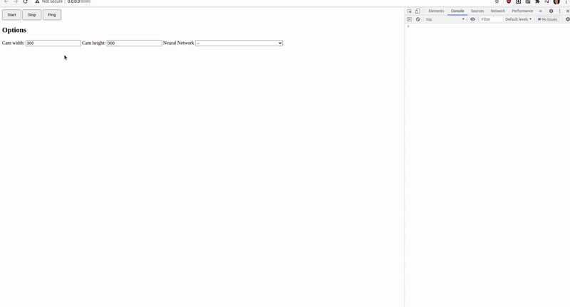

# WebRTC Streaming

This experiment demonstrates how to setup a WebRTC server to configure the device and stream the results and preview from it.

## Demo



## Installation

You need to prepare a Python 3.10 environment with [DepthAI](https://pypi.org/project/depthai/) and [DepthAI Nodes](https://pypi.org/project/depthai-nodes/) packages installed. You can do this by running:

```bash
pip install -r requirements.txt
```

[Enable insecure origins to be treated as secure (Chrome)](https://stackoverflow.com/a/58449078/5494277)

> To ignore Chrome’s secure origin policy, follow these steps. Navigate to chrome://flags/#unsafely-treat-insecure-origin-as-secure in Chrome.\
> Find and enable the Insecure origins treated as secure section (see below). Add any addresses you want to ignore the secure origin policy for. Remember to include the port number too (if required).
> 
> Save and restart Chrome.
> Remember this is for dev purposes only. The live working app will need to be hosted on https.

Build the frontend web application. Go to the `webrtc-streaming/client` folder and run:

```bash
npm install
npm run build
```

## Usage

You can run the experiment in fully on device (`STANDALONE` mode) or using your your computer as host (`PERIPHERAL` mode).

### Peripheral Mode

```bash
python3 main.py
```

### Standalone Mode

Running the experiment in the [Standalone mode](https://rvc4.docs.luxonis.com/software/depthai/standalone/) runs the app entirely on the device.
To run the example in this mode, first install the [oakctl](https://rvc4.docs.luxonis.com/software/tools/oakctl/) command-line tool (enables host-device interaction) as:

```bash
bash -c "$(curl -fsSL https://oakctl-releases.luxonis.com/oakctl-installer.sh)"
```

# TODO: add instructions for standalone mode once oakctl supports CLI arguments
