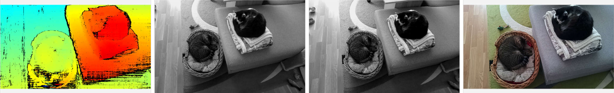

# Camera Demo

This experiment shows how to preview video and depth streams from cameras.

## Demo



## Installation

```bash
pip install -r requirements.txt
```

## Usage

You can run the experiment in fully on device (`STANDALONE` mode) or using your your computer as host (`PERIPHERAL` mode).

Here is a list of all available parameters:

```
-d DEVICE, --device DEVICE
                    Optional name, DeviceID or IP of the camera to connect to. (default: None)
-fps FPS_LIMIT, --fps_limit FPS_LIMIT
                    FPS limit for the model runtime. (default: 30)
```

#### Examples

```bash
python3 main.py
```

This will run the Camera Demo experiment with the default device and camera input.

```bash
python3 main.py -fps 10
```

This will run the Camera Demo experiment with the default device at 10 FPS.

### Standalone Mode

Running the experiment in the [Standalone mode](https://rvc4.docs.luxonis.com/software/depthai/standalone/) runs the app entirely on the device.
To run the example in this mode, first install the [oakctl](https://rvc4.docs.luxonis.com/software/tools/oakctl/) command-line tool (enables host-device interaction) as:

```bash
bash -c "$(curl -fsSL https://oakctl-releases.luxonis.com/oakctl-installer.sh)"
```

# TODO: add instructions for standalone mode once oakctl supports CLI arguments
