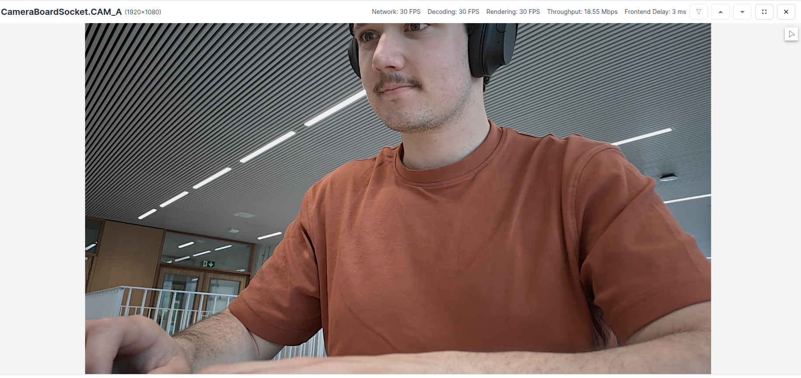
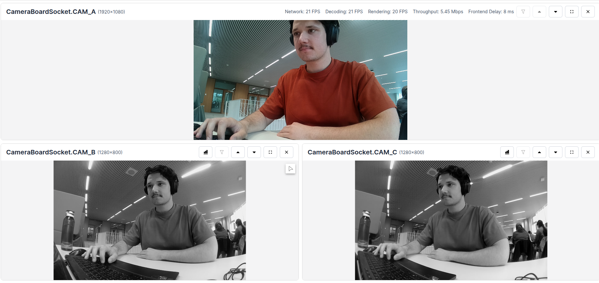

# Camera Demo

This experiment streams all camera sensors of the connected device to the visualizer. All streams are limited to (1920, 1080) resolution and are H.264 encoded.

## Demo




## Usage

Running this example requires a **Luxonis device** connected to your computer. Refer to the [documentation](https://stg.docs.luxonis.com/software-v3/) to setup your device if you haven't done it already.

You can run the experiment fully on device ([`STANDALONE` mode](#standalone-mode-rvc4-only)) or using your computer as host ([`PERIPHERAL` mode](#peripheral-mode)).

Here is a list of all available parameters:

```
-d DEVICE, --device DEVICE
                    Optional name, DeviceID or IP of the camera to connect to. (default: None)
-fps FPS_LIMIT, --fps_limit FPS_LIMIT
                    FPS limit for the model runtime. (default: 30)
```

## Peripheral Mode

### Installation

You need to first prepare a **Python 3.10** environment with the following packages installed:

- [DepthAI](https://pypi.org/project/depthai/),
- [DepthAI Nodes](https://pypi.org/project/depthai-nodes/).

You can simply install them by running:

```bash
pip install -r requirements.txt
```

Running in peripheral mode requires a host computer and there will be communication between device and host which could affect the overall speed of the app. Below are some examples of how to run the example.

### Examples

```bash
python3 main.py
```

This will run the Camera Demo experiment with the default device and camera input.

```bash
python3 main.py -fps 10
```

This will run the Camera Demo experiment with the default device at 10 FPS.

## Standalone Mode (RVC4 only)

Running the example in the standalone mode, app runs entirely on the device.
To run the example in this mode, first install the `oakctl` tool using the installation instructions [here](https://stg.docs.luxonis.com/software-v3/oak-apps/oakctl).

The app can then be run with:

```bash
oakctl connect <DEVICE_IP>
oakctl app run .
```

This will run the experiment with default argument values. If you want to change these values you need to edit the `oakapp.toml` file (refer [here](https://stg.docs.luxonis.com/software-v3/oak-apps/configuration/) for more information about this configuration file).
