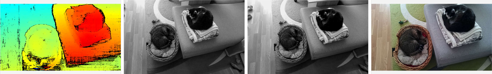

# Camera Stereo Depth

This experiment shows a minimal implementation of stereo detph implementation.

## Demo



## Installation

Running this example requires a **stereo enabled Luxonis device**  connected to your computer. You can find more information about the supported devices and the set up instructions in our [Documentation](https://rvc4.docs.luxonis.com/hardware).

Install required packages by running:

```bash
pip install -r requirements.txt
```

## Usage

You can run the experiment fully on device (`STANDALONE` mode) or using your your computer as host (`PERIPHERAL` mode). `STANDALONE` mode is only supported on RVC4.

All scripts accept the following arguments:

```
-d DEVICE, --device DEVICE
                    Optional name, DeviceID or IP of the camera to connect to. (default: None)
-fps FPS_LIMIT, --fps_limit FPS_LIMIT
                    FPS limit for the model runtime. (default: 30)
```

### Peripheral Mode

Running in peripheral mode requires a host computer and there will be communication between device and host which could affect the overall speed of the app. Below are some examples of how to run the example.

#### Examples

```bash
python3 main.py
```

This will run the Camera Demo experiment with the default device and camera input.

```bash
python3 main.py -fps 10
```

This will run the Camera Demo experiment with the default device at 10 FPS.

### Standalone Mode

Running the example in the [Standalone mode](https://rvc4.docs.luxonis.com/software/depthai/standalone/), app runs entirely on the device.
To run the example in this mode, first install the [oakctl](https://rvc4.docs.luxonis.com/software/tools/oakctl/) command-line tool (enables host-device interaction) as:

```bash
bash -c "$(curl -fsSL https://oakctl-releases.luxonis.com/oakctl-installer.sh)"
```

The app can then be run with:

```bash
oakctl connect <DEVICE_IP>
oakctl app run .
```

This will run the experiment with default argument values. If you want to change these values you need to edit the `oakapp.toml` file.
