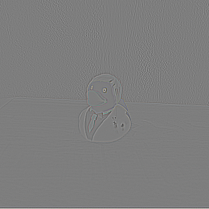
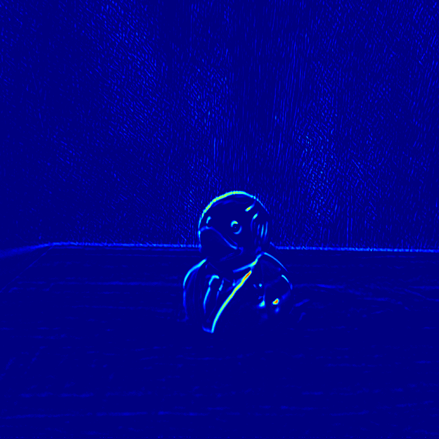

# Model generation

This directory contains scripts that generate [NN Archives](https://rvc4.docs.luxonis.com/software/ai-inference/nn-archive/) compatible with **Luxonis devices** for the custom models in this folder. The scripts utilize [ModelConverter](https://rvc4.docs.luxonis.com/software/ai-inference/conversion/rvc-conversion/offline/modelconverter/) for the NN Archive generation and model conversion.

## Models

#### Concatenate frames


Uses [torch.cat](https://pytorch.org/docs/stable/generated/torch.cat.html) operation to concatenate multiple frames.

#### Blur frames


Uses [kornia.filters.GaussianBlur2d](https://kornia.readthedocs.io/en/latest/filters.html?highlight=GaussianBlur2d#kornia.filters.GaussianBlur2d) filter to create blurring model.

#### Edge detection



Uses [kornia.filters.Laplacian](https://kornia.readthedocs.io/en/latest/filters.html?highlight=laplacian#kornia.filters.Laplacian) filter to create edge detection model.

#### Frame difference



Uses [torch.sub](https://pytorch.org/docs/stable/generated/torch.sub.html) operation to compute the difference between two frames. Can be used to detect motion in consecutive frames.

## Installation

The model generation scripts require **Docker** to be installed. You can install Docker by following the instructions [here](https://docs.docker.com/engine/install/). You must also install the required packages specified in `requirements.txt` file:

```bash
pip install -r requirements.txt
```

## Usage

You can generate each model by running the corresponding script. The scripts accept the following arguments:

```
positional arguments:
  {rvc2,rvc3,rvc4}  Platform to generate NN archive for.
```

The generated NN Archives will be available in the `out/shared_with_container/models` directory.

#### Examples

```bash
python3 kornia_blur.py rvc2
```

This will generate the NN Archive, that can be used on the RVC2 platform.

```bash
python3 pytorch_concat.py rvc4
```

This will generate the NN Archive, that can be used on the RVC4 platform.
