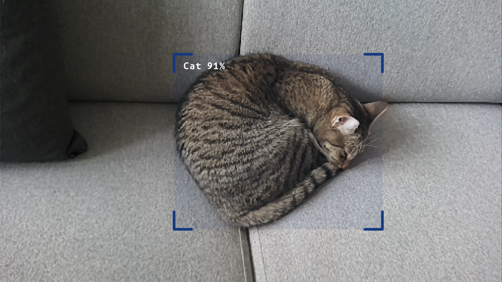
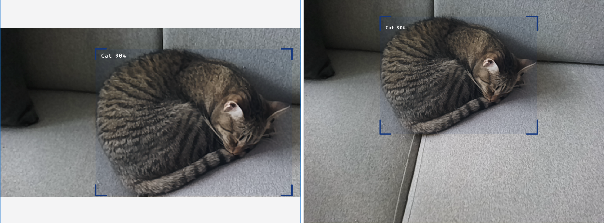

# Display detections on higher resolution frames

Object detection models usually require smaller frame for inferencing (eg. `512x288`). Instead of displaying bounding boxes on such small frames, you could also stream higher resolution frames and display bounding boxes on these frames. There are several approaches to achieving that, and this example will go over some of them. It uses [YOLOv6 Nano](https://models.luxonis.com/luxonis/yolov6-nano/face58c4-45ab-42a0-bafc-19f9fee8a034) model for object detection.

## Demo

### 1. Passthrough

Simplest approach is to just stream the small inferencing frame. This example uses `passthrough` frame of `ParsingNeuralNetwork`'s output so bounding boxes are in sync with the frame.



### 2. Crop high resolution frame

A simple solution to low resolution frame is to use higher resolution frames and crop them to the correct size of the NN input. This example crops `640x480` frame to `512x288`.



### 3. Stretch or crop the frame before inferencing but keep the high resolution frame

Another solution is to stretch the frame to the correct aspect ratio and size of the NN. For more information, see [Resolution Techniques for NNs](https://docs.luxonis.com/software/depthai/resolution-techniques). This example stretches `1920x1440` frame to `512x288` before inferencing.


## Usage

Running this example requires a **Luxonis device** connected to your computer. Refer to the [documentation](https://docs.luxonis.com/software-v3/) to setup your device if you haven't done it already.

You can run the example fully on device ([`STANDALONE` mode](#standalone-mode-rvc4-only)) or using your computer as host ([`PERIPHERAL` mode](#peripheral-mode)).

Here is a list of all available parameters:

```
-d DEVICE, --device DEVICE
                    Optional name, DeviceID or IP of the camera to connect to. (default: None)
-fps FPS_LIMIT, --fps_limit FPS_LIMIT
                    FPS limit for the model runtime. (default: 30)
```

## Peripheral Mode

### Installation

You need to first prepare a **Python 3.10** environment with the following packages installed:

- [DepthAI](https://pypi.org/project/depthai/),
- [DepthAI Nodes](https://pypi.org/project/depthai-nodes/).

You can simply install them by running:

```bash
pip install -r requirements.txt
```

Running in peripheral mode requires a host computer and there will be communication between device and host which could affect the overall speed of the app. Below are some examples of how to run the example.

### Examples

```bash
python3 passthrough.py
```

This will run the Display Detections example with the default device and camera input and use passthrough frame.

```bash
python3 crop_highres.py
```

This will run the Display Detections example with the default device and camera input and crop `640x480` frame to `512x288`.

```bash
python3 stretch_before_inferencing.py -fps 10
```

This will run the Display Detections example with the default device at 10 FPS and stretch `1920x1440` frame to `512x288`.

## Standalone Mode (RVC4 only)

Running the example in the standalone mode, app runs entirely on the device.
To run the example in this mode, first install the `oakctl` tool using the installation instructions [here](https://docs.luxonis.com/software-v3/oak-apps/oakctl).

The app can then be run with:

```bash
oakctl connect <DEVICE_IP>
oakctl app run .
```

This will run the example with default argument values. If you want to change these values you need to edit the `oakapp.toml` file (refer [here](https://docs.luxonis.com/software-v3/oak-apps/configuration/) for more information about this configuration file).
