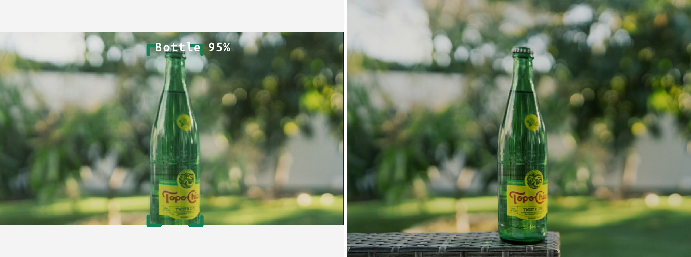
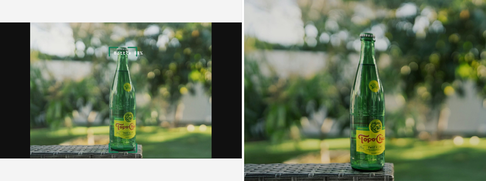
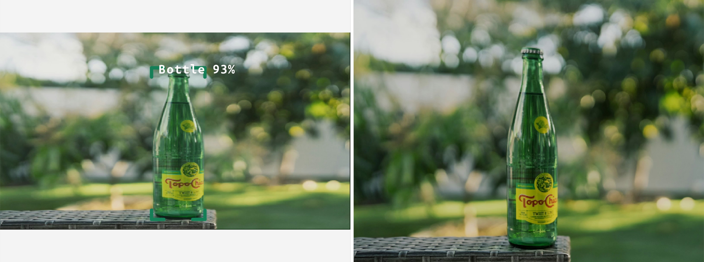

# Full FOV NN inferencing

This example demonstrates how to run NN inferencing on full FOV frames. It uses a video stream with a different aspect ratio than the NN input. [YOLOv6](https://zoo-rvc4.luxonis.com/luxonis/yolov6-nano/face58c4-45ab-42a0-bafc-19f9fee8a034) is used for object detection.
See [Resolution Techniques for NNs](https://docs.luxonis.com/software/depthai/resolution-techniques) for more information.

This example demonstrates how to run NN inferencing on full FOV frames. It uses a video stream with a different aspect ratio than the NN input. [YOLOv6 Nano](https://zoo-rvc4.luxonis.com/luxonis/yolov6-nano/face58c4-45ab-42a0-bafc-19f9fee8a034) is used for object detection.

There are 3 options, how to match the NN input aspect ration:

1. Crop the original frame before inferencing and lose some FOV
1. Apply letterboxing to the frame to get the correct aspect ratio and lose some accuracy
1. Stretch the frame to the correct aspect ratio of the NN and lose some accuracy

## Demo

### Cropping



### Letterboxing



### Stretching



## Usage

Running this example requires a **Luxonis device** connected to your computer. Refer to the [documentation](https://docs.luxonis.com/software-v3/) to setup your device if you haven't done it already.

You can run the example fully on device ([`STANDALONE` mode](#standalone-mode-rvc4-only)) or using your computer as host ([`PERIPHERAL` mode](#peripheral-mode)).

Here is a list of all available parameters:

```
-d DEVICE, --device DEVICE
                    Optional name, DeviceID or IP of the camera to connect to. (default: None)
-fps FPS_LIMIT, --fps_limit FPS_LIMIT
                    FPS limit for the model runtime. (default: 30)
```

This example contains 4 different scripts.

#### `main.py`

This is the main script that runs the example and lets you choose the resize mode during runtime by using the following keybinds:

| Key | Mode         |
| --- | ------------ |
| a   | Letterboxing |
| s   | Crop         |
| d   | Stretch      |

#### `letterboxing.py`, `cropping.py` and `stretch.py`

These scripts run only in the corresponding mode, which cannot be toggled during runtime.

## Peripheral Mode

### Installation

You need to first prepare a **Python 3.10** environment with the following packages installed:

- [DepthAI](https://pypi.org/project/depthai/),
- [DepthAI Nodes](https://pypi.org/project/depthai-nodes/).

You can simply install them by running:

```bash
pip install -r requirements.txt
```

Running in peripheral mode requires a host computer and there will be communication between device and host which could affect the overall speed of the app. Below are some examples of how to run the example.

### Examples

```bash
python3 main.py
```

This will run the Full FOV NN inferencing example with the default device and camera input.

```bash
python3 cropping.py -fps 10
```

This will run the Full FOV NN inferencing example using cropping resize mode with the default device at 10 FPS.

## Standalone Mode (RVC4 only)

Running the example in the standalone mode, app runs entirely on the device.
To run the example in this mode, first install the `oakctl` tool using the installation instructions [here](https://docs.luxonis.com/software-v3/oak-apps/oakctl).

The app can then be run with:

```bash
oakctl connect <DEVICE_IP>
oakctl app run .
```

This will run the experiment with default argument values. If you want to change these values you need to edit the `oakapp.toml` file (refer [here](https://docs.luxonis.com/software-v3/oak-apps/configuration/) for more information about this configuration file).
