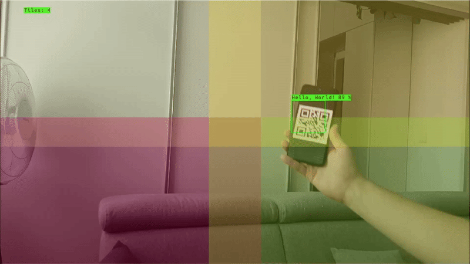

# QR Code Detection with Tiling

This experiment uses [QRDet](https://zoo-rvc4.luxonis.com/luxonis/qrdet/d1183a0f-e9a0-4fa2-8437-f2f5b0181739) neural network to detect QR codes. These QR codes are then decoded on the host. The experiment utilizes tiling to divide the input frame into multiple smaller frames. Each smaller frame is passed to the QR detection network and processed independently. You can modify this exepriment to detect any small object on input images.

## Demo



## Usage

Running this example requires a **Luxonis device** connected to your computer. Refer to the [documentation](https://docs.luxonis.com/software-v3/) to setup your device if you haven't done it already.

You can run the experiment fully on device ([`STANDALONE` mode](#standalone-mode-rvc4-only)) or using your computer as host ([`PERIPHERAL` mode](#peripheral-mode)).

Here is a list of all available parameters:

```
-d DEVICE, --device DEVICE
                    Optional name, DeviceID or IP of the camera to connect to. (default: None)
-fps FPS_LIMIT, --fps_limit FPS_LIMIT
                    FPS limit for the model runtime. (default: 5)
-media MEDIA_PATH, --media_path MEDIA_PATH
                    Path to the media file you aim to run the model on. If not set, the model will run on the camera input.
-r ROWS, --rows ROWS
                    Number of rows in the grid for dividing the output into smaller frames. (default: 2)
-c COLUMNS, --columns COLUMNS
                    Number of columns in the grid for dividing the output into smaller frames. (default: 2)
-is INPUT_SIZE, --input_size INPUT_SIZE
                    Input video stream resolution. {2160p, 1080p, 720p} (default: 1080p)
```

## Peripheral Mode

### Installation

You need to first prepare a **Python 3.10** environment with the following packages installed:

- [DepthAI](https://pypi.org/project/depthai/),
- [DepthAI Nodes](https://pypi.org/project/depthai-nodes/).

Install the zbar library:

```
sudo apt-get install libzbar0
```

You can simply install them by running:

```bash
pip install -r requirements.txt
```

Running in peripheral mode requires a host computer and there will be communication between device and host which could affect the overall speed of the app. Below are some examples of how to run the example.

### Examples

```bash
python3 main.py
```

This will run the QR Code Detection with Tiling experiment with the default device and camera input.

```bash
python3 main.py -fps 10
```

This will run the QR Code Detection with Tiling experiment with the default device at 10 FPS.

```bash
python3 main.py -media /path/to/media.mp4
```

This will run the QR Code Detection with Tiling experiment with the default device and the specified media file.

```bash
python3 main.py -r 3 -c 3
```

This will run the QR Code Detection with Tiling experiment with the default device and the specified grid size.

## Standalone Mode (RVC4 only)

Running the example in the standalone mode, app runs entirely on the device.
To run the example in this mode, first install the `oakctl` tool using the installation instructions [here](https://docs.luxonis.com/software-v3/oak-apps/oakctl).

The app can then be run with:

```bash
oakctl connect <DEVICE_IP>
oakctl app run .
```

This will run the experiment with default argument values. If you want to change these values you need to edit the `oakapp.toml` file (refer [here](https://docs.luxonis.com/software-v3/oak-apps/configuration/) for more information about this configuration file).
